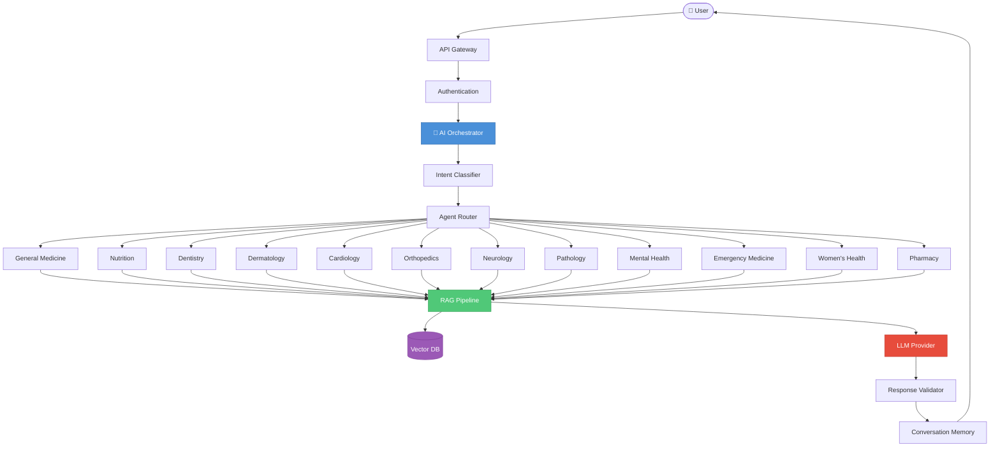
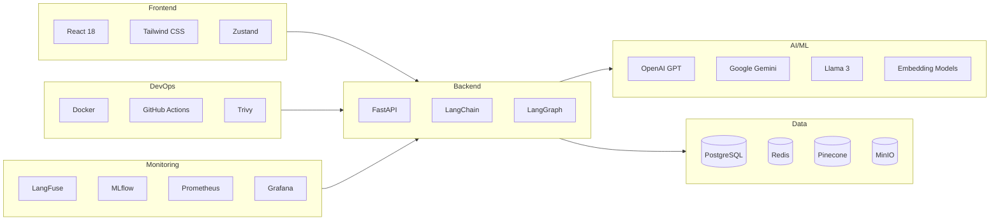

<div align="center">

# 🏥 MediOrchestrator AI

### Agentic Multi-LLM Healthcare Intelligence Platform

[](LICENSE)
[](https://python.org)
[](https://fastapi.tiangolo.com)
[](https://react.dev)
[](https://langchain.com)
[](https://docker.com)

---

**MediOrchestrator AI** is not a chatbot. It is an **Agentic AI Healthcare Platform** that orchestrates multiple specialized AI agents across **12 medical domains** using intelligent routing, retrieval-augmented generation, and multi-LLM collaboration.

[Documentation](#-documentation) · [Architecture](#-architecture) · [Getting Started](#-getting-started) · [Tech Stack](#-technology-stack)

</div>

---

## 🎯 What Makes This Different

| Traditional Health Chatbot | MediOrchestrator AI |
|---|---|
| Single LLM, generic responses | Multi-LLM orchestration with domain specialists |
| No medical context | RAG-powered domain knowledge bases |
| No routing intelligence | Intent classification → Agent selection |
| Static conversations | Conversation memory with context management |
| Single domain | 12 specialized healthcare domains |
| No validation | Medical response validation + confidence scoring |

---

## 🏗 Architecture



---

## 📚 Documentation

| # | Document | Description |
|---|---|---|
| 1 | [Project Foundation](docs/01_Project_Foundation.md) | Vision, problem statement, objectives, scope, features |
| 2 | [System Architecture & Design](docs/02_System_Architecture_and_Design.md) | Full system architecture, database, APIs, deployment |
| 3 | [AI & Agent Architecture](docs/03_AI_and_Agent_Architecture.md) | Agentic AI, orchestration, RAG, agents, knowledge bases |
| 4 | [Development & Implementation](docs/04_Development_and_Implementation.md) | Folder structures, coding standards, CI/CD, testing |
| 5 | [Deployment, Security & Research](docs/05_Deployment_Security_Research.md) | Deployment, security, monitoring, research opportunities |

> 📄 PDF versions available in the [`pdf/`](pdf/) directory.

---

## 🔧 Technology Stack



| Layer | Technologies |
|---|---|
| **Frontend** | React 18, Tailwind CSS, Zustand, React Query, Vite |
| **Backend** | FastAPI, Python 3.11+, Pydantic, SQLAlchemy |
| **AI/ML** | LangChain, LangGraph, OpenAI, Gemini, Llama 3 |
| **Vector DB** | Pinecone / Qdrant |
| **Database** | PostgreSQL 16, Redis 7 |
| **Storage** | MinIO (S3-compatible) |
| **DevOps** | Docker, Docker Compose, GitHub Actions |
| **Security** | JWT, OAuth 2.0, Trivy, SBOM |
| **Monitoring** | LangFuse, MLflow, Prometheus, Grafana |

---

## 🚀 Getting Started

### Prerequisites

- Python 3.11+
- Node.js 18+
- Docker & Docker Compose
- API keys (OpenAI / Google Gemini)

### Quick Start

```bash
# Clone the repository
git clone https://github.com/Samarjamal326/MediOrchesctrator-Agent.git
cd MediOrchesctrator-Agent

# Start all services
docker-compose up -d

# Backend
cd backend && pip install -r requirements.txt
uvicorn main:app --reload

# Frontend
cd frontend && npm install && npm run dev
```

---

## 🧠 Healthcare Domains

| Domain | Agent | Knowledge Base |
|---|---|---|
| 🩺 General Medicine | `general_medicine_agent` | Clinical guidelines, symptoms, diagnostics |
| 🥗 Nutrition | `nutrition_agent` | Dietary plans, nutritional science |
| 🦷 Dentistry | `dentistry_agent` | Oral health, dental procedures |
| 🧴 Dermatology | `dermatology_agent` | Skin conditions, treatments |
| ❤️ Cardiology | `cardiology_agent` | Heart health, cardiovascular data |
| 🦴 Orthopedics | `orthopedics_agent` | Bone/joint conditions, rehabilitation |
| 🧠 Neurology | `neurology_agent` | Neurological conditions, brain health |
| 🔬 Pathology | `pathology_agent` | Lab results, diagnostic testing |
| 💚 Mental Health | `mental_health_agent` | Psychology, therapy approaches |
| 🚑 Emergency Medicine | `emergency_agent` | Triage, emergency protocols |
| 🩷 Women's Health | `womens_health_agent` | Gynecology, reproductive health |
| 💊 Pharmacy | `pharmacy_agent` | Drug interactions, medications |

---

## 📂 Repository Structure

```
MediOrchesctrator-Agent/
├── README.md
├── docs/
│   ├── 01_Project_Foundation.md
│   ├── 02_System_Architecture_and_Design.md
│   ├── 03_AI_and_Agent_Architecture.md
│   ├── 04_Development_and_Implementation.md
│   └── 05_Deployment_Security_Research.md
├── pdf/
│   └── [PDF versions of all docs]
├── diagrams/
├── assets/
├── backend/
│   ├── app/
│   │   ├── agents/
│   │   ├── api/
│   │   ├── core/
│   │   ├── models/
│   │   ├── services/
│   │   └── knowledge/
│   ├── tests/
│   └── requirements.txt
├── frontend/
│   ├── src/
│   │   ├── components/
│   │   ├── pages/
│   │   ├── services/
│   │   └── store/
│   └── package.json
├── docker-compose.yml
└── .github/
    └── workflows/
```

---

## 👥 Team

| Role | Responsibility |
|---|---|
| AI/ML Engineer | Agent design, RAG pipelines, LLM integration |
| Backend Developer | FastAPI, database, authentication |
| Frontend Developer | React UI, state management |
| DevOps Engineer | Docker, CI/CD, deployment |

---

## 📄 License

This project is licensed under the MIT License.

---

<div align="center">

**Built with ❤️ for healthcare innovation**

*MediOrchestrator AI — Where AI Agents Meet Healthcare Intelligence*

</div>
