

# 📋 Project Foundation

## MediOrchestrator AI

**Agentic Multi-LLM Healthcare Intelligence Platform**

---

## Table of Contents

- [Project Vision](#-project-vision)
- [Problem Statement](#-problem-statement)
- [Current Challenges](#-current-challenges-in-healthcare-ai)
- [Existing Solutions](#-existing-solutions--gap-analysis)
- [Objectives](#-objectives)
- [Scope](#-scope)
- [Target Users](#-target-users)
- [Project Features](#-project-features)
- [Technology Overview](#-technology-overview)
- [Research Opportunities](#-research-opportunities)
- [Expected Outcomes](#-expected-outcomes)
- [Success Criteria](#-success-criteria)
- [High-Level Workflow](#-high-level-workflow)
- [Conclusion](#-conclusion)

---

## 🎯 Project Vision

**Build an AI platform where specialized healthcare agents collaborate to deliver accurate, context-aware medical guidance.**

MediOrchestrator AI replaces the single-LLM chatbot model with an **agentic architecture** — an AI Orchestrator routes user queries to domain-specific agents, each backed by curated medical knowledge bases and retrieval-augmented generation.

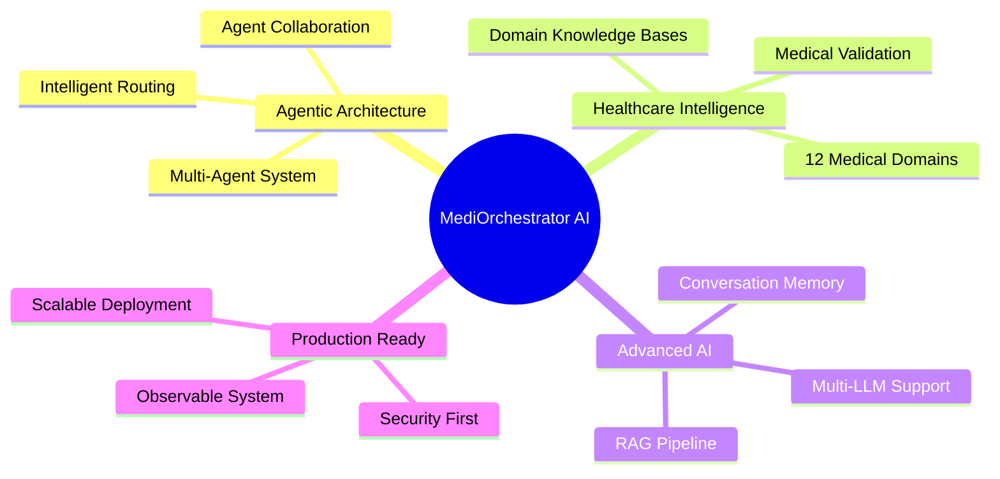

### Vision Pillars

| Pillar | Description |
|---|---|
| **Specialization** | Each medical domain gets a dedicated AI agent with domain-specific knowledge |
| **Intelligence** | AI Orchestrator understands intent and routes to the right specialist |
| **Accuracy** | RAG ensures responses are grounded in verified medical literature |
| **Memory** | Conversation context is maintained across interactions |
| **Extensibility** | New agents and domains can be added without system redesign |

---

## 🔍 Problem Statement

Healthcare information seekers face a fundamental problem:

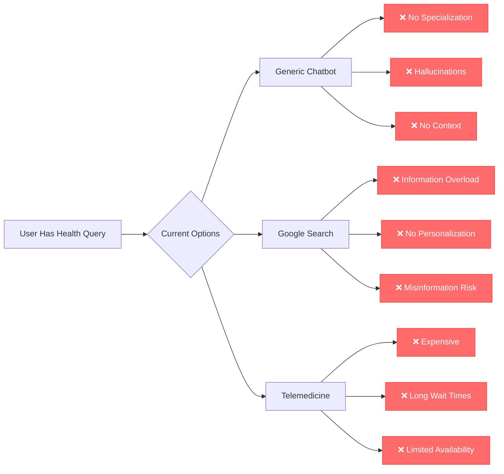

### Core Problems

| # | Problem | Impact |
|---|---|---|
| 1 | Generic AI lacks medical specialization | Inaccurate domain-specific advice |
| 2 | LLMs hallucinate medical facts | Dangerous health misinformation |
| 3 | No conversation context retention | Users repeat symptoms every session |
| 4 | No source verification | Cannot trace medical claims to evidence |
| 5 | Single-model limitations | One LLM cannot excel in all domains |
| 6 | No cross-domain reasoning | Misses connections between symptoms |

> [!CAUTION]
> Medical AI without proper guardrails, validation, and knowledge grounding can cause real harm. MediOrchestrator AI addresses this with multi-layer validation.

---

## ⚡ Current Challenges in Healthcare AI

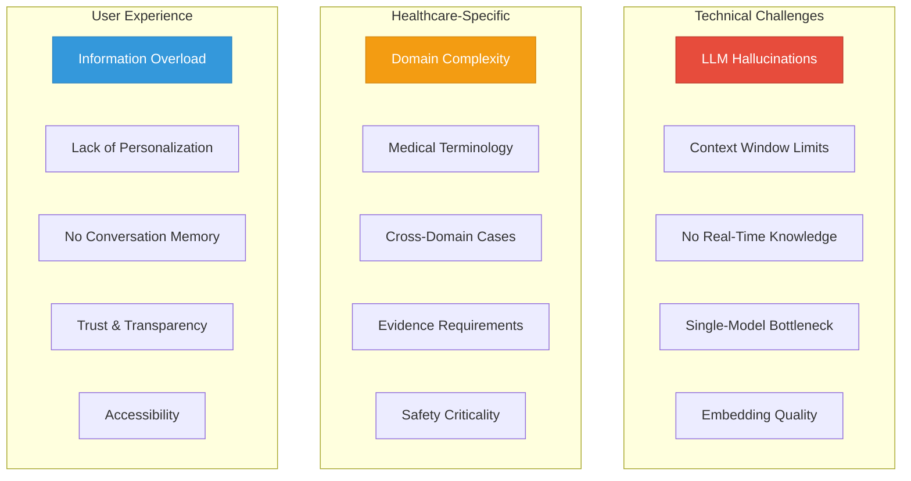

| Category | Challenge | MediOrchestrator Solution |
|---|---|---|
| **Hallucinations** | LLMs generate plausible but incorrect medical info | RAG grounds responses in verified knowledge bases |
| **Specialization** | One model cannot master all medical domains | 12 specialized agents with domain expertise |
| **Context** | AI forgets previous conversation | Conversation memory with session persistence |
| **Routing** | Users don't know which specialist they need | Intent classification auto-routes to correct agent |
| **Validation** | No way to verify AI medical claims | Response validation with confidence scoring |
| **Scalability** | Adding new domains requires full redesign | Plugin-based agent architecture |

---

## 📊 Existing Solutions & Gap Analysis

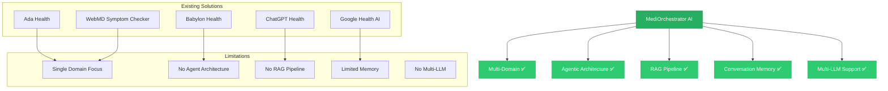

| Feature | Ada Health | Babylon | ChatGPT | WebMD | **MediOrchestrator AI** |
|---|---|---|---|---|---|
| Multi-Domain Agents | ❌ | ❌ | ❌ | ❌ | ✅ |
| RAG Knowledge Base | ❌ | Partial | ❌ | ❌ | ✅ |
| Multi-LLM Support | ❌ | ❌ | ❌ | ❌ | ✅ |
| Conversation Memory | ❌ | Limited | Limited | ❌ | ✅ |
| Intent-Based Routing | ❌ | ❌ | ❌ | ❌ | ✅ |
| Agent Collaboration | ❌ | ❌ | ❌ | ❌ | ✅ |
| Response Validation | ❌ | Partial | ❌ | ❌ | ✅ |
| Open Architecture | ❌ | ❌ | ❌ | ❌ | ✅ |
| Confidence Scoring | ❌ | ❌ | ❌ | ❌ | ✅ |
| Source Citations | ❌ | ❌ | ❌ | Partial | ✅ |

> [!NOTE]
> MediOrchestrator AI is not a replacement for professional medical advice. It is a demonstration of advanced agentic AI architecture applied to healthcare information delivery.

---

## 🎯 Objectives

### Primary Objectives

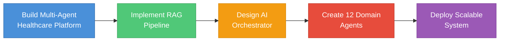

| # | Objective | Measurable Outcome |
|---|---|---|
| 1 | Build an AI Orchestrator that routes queries to specialized agents | Correct agent selection ≥ 90% accuracy |
| 2 | Implement RAG pipeline with domain-specific knowledge bases | Response grounding with source citations |
| 3 | Support 12 healthcare domains with dedicated agents | Each agent handles domain-specific queries |
| 4 | Maintain conversation context across sessions | Context retrieval within 200ms |
| 5 | Validate AI responses for medical accuracy | Confidence scoring on every response |
| 6 | Deploy containerized, production-ready system | Docker-based deployment with CI/CD |

### Technical Objectives

| Area | Objective |
|---|---|
| **AI** | Multi-LLM orchestration with LangChain + LangGraph |
| **RAG** | Vector-based knowledge retrieval with medical embeddings |
| **Backend** | High-performance async API with FastAPI |
| **Frontend** | Responsive React UI with real-time streaming |
| **Security** | JWT + OAuth authentication, OWASP compliance |
| **DevOps** | Docker containerization, GitHub Actions CI/CD |
| **Monitoring** | LangFuse tracing, MLflow experiment tracking |

---

## 📐 Scope

### In Scope

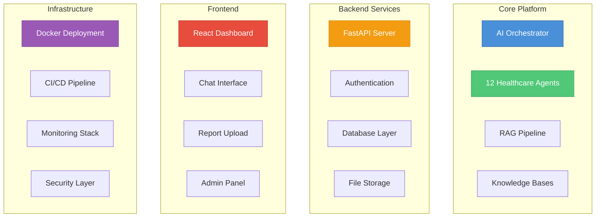

### Out of Scope

| Excluded | Reason |
|---|---|
| Medical diagnosis or prescription | Regulatory and ethical constraints |
| EHR/EMR integration | Requires healthcare compliance (HIPAA) |
| Real-time video consultation | Different product category |
| Insurance/billing systems | Not within project scope |
| Mobile native apps | Web-first approach; mobile as future enhancement |

---

## 👥 Target Users

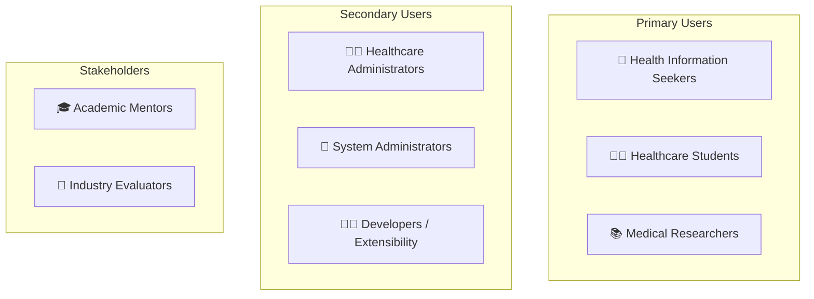

| User Type | Need | Platform Feature |
|---|---|---|
| Health Information Seeker | Reliable, domain-specific health info | Specialized agents + RAG |
| Healthcare Student | Learn from structured medical knowledge | Knowledge base + citations |
| Medical Researcher | Explore AI in healthcare applications | Multi-agent architecture |
| System Administrator | Manage platform and monitor performance | Admin panel + monitoring |
| Developer | Extend with new agents and domains | Plugin architecture |

---

## ⭐ Project Features

### Feature Matrix

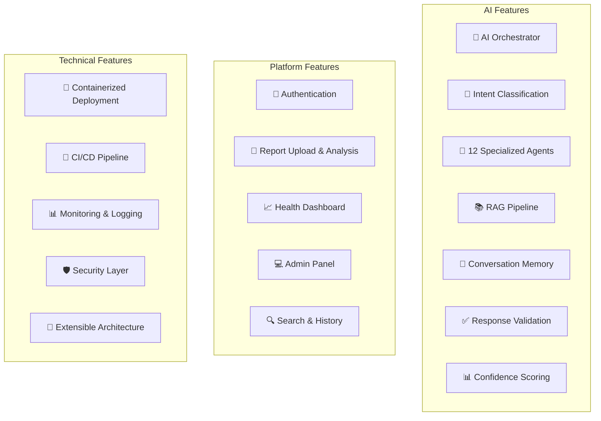

### Core Features Detail

| Feature | Description | Key Benefit |
|---|---|---|
| **AI Orchestrator** | Central intelligence that manages query flow | Intelligent routing to specialists |
| **Intent Classification** | NLP-based query understanding | Accurate domain identification |
| **Agent Selection** | Dynamic agent routing based on intent | Right specialist for every query |
| **RAG Pipeline** | Retrieval-augmented generation | Evidence-grounded responses |
| **Multi-LLM Support** | OpenAI, Gemini, Llama integration | Best model per domain |
| **Conversation Memory** | Session-persistent context | Continuous conversation flow |
| **Response Validation** | Medical accuracy verification | Reduced hallucination risk |
| **Confidence Scoring** | Certainty level per response | Transparent AI decision-making |
| **Report Analysis** | Upload and analyze medical reports | AI-assisted report interpretation |
| **Knowledge Base** | Curated medical domain data | Verified information source |
| **Admin Panel** | System management dashboard | Full platform control |
| **Extensible Agents** | Plugin-based agent addition | Future domain expansion |

---

## 🛠 Technology Overview

### Technology Architecture

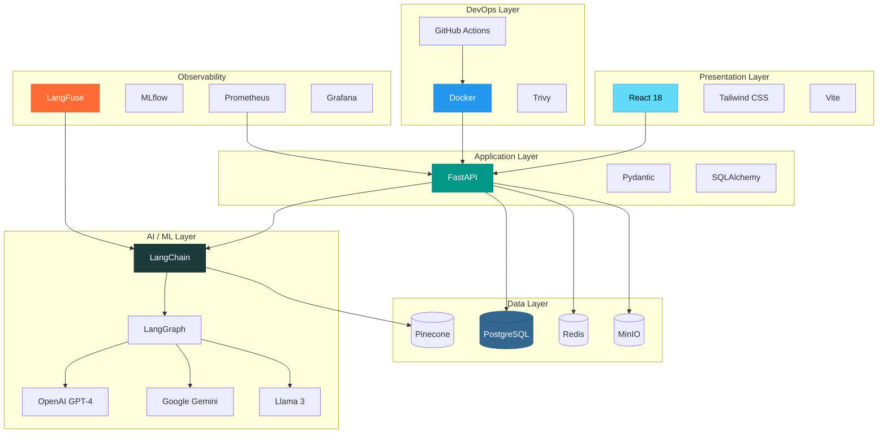

### Technology Decision Matrix

| Technology | Purpose | Why Chosen | Alternatives Considered |
|---|---|---|---|
| **FastAPI** | Backend framework | Async, auto-docs, type-safe | Django, Flask, Express.js |
| **React 18** | Frontend framework | Component-based, ecosystem | Vue, Angular, Svelte |
| **LangChain** | LLM orchestration | Chain composition, tools | LlamaIndex, Semantic Kernel |
| **LangGraph** | Agent workflow | State machines for agents | AutoGen, CrewAI |
| **PostgreSQL** | Primary database | ACID, JSON support, mature | MySQL, MongoDB |
| **Redis** | Caching & sessions | In-memory speed, pub/sub | Memcached |
| **Pinecone** | Vector database | Managed, scalable, fast | Qdrant, Weaviate, ChromaDB |
| **Docker** | Containerization | Consistent environments | Podman, bare metal |
| **MinIO** | Object storage | S3-compatible, self-hosted | AWS S3, Cloudflare R2 |
| **LangFuse** | LLM observability | Trace chains, cost tracking | Langsmith, Helicone |
| **MLflow** | Experiment tracking | Model versioning, metrics | Weights & Biases |
| **Trivy** | Security scanning | Container + dependency scans | Snyk, Grype |

---

## 🔬 Research Opportunities

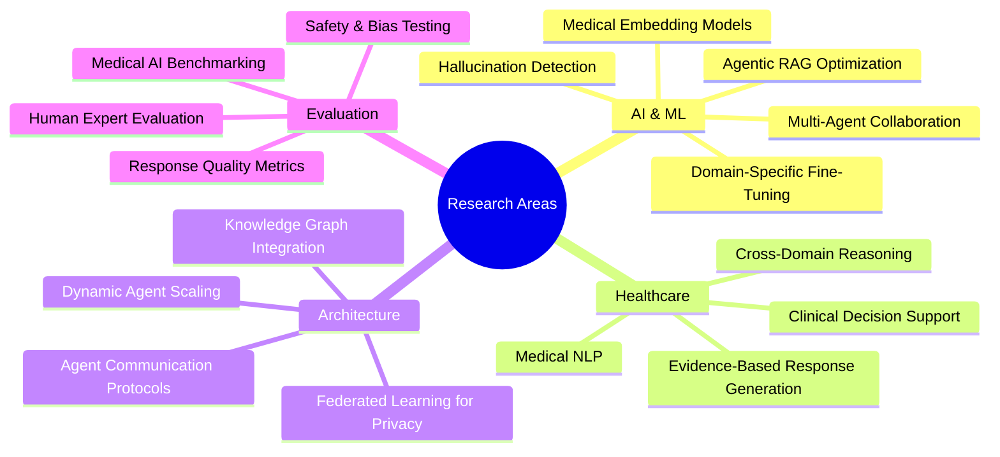

| Research Area | Focus | Publication Potential |
|---|---|---|
| Multi-Agent Medical Reasoning | How agents collaborate on cross-domain cases | High — novel approach |
| RAG for Medical Literature | Domain-specific retrieval strategies | Medium — incremental |
| Hallucination Detection | Medical fact verification pipeline | High — critical problem |
| Agentic AI Architecture | Orchestration patterns for healthcare | High — emerging field |
| Medical Embedding Quality | Comparing embedding models for medical text | Medium — benchmark study |
| Explainable AI in Healthcare | Confidence scoring and reasoning chains | High — regulatory need |

---

## 📈 Expected Outcomes

### Deliverables

| # | Deliverable | Type |
|---|---|---|
| 1 | Working MediOrchestrator platform | Software |
| 2 | 12 specialized healthcare agents | AI Agents |
| 3 | RAG pipeline with medical knowledge | AI Pipeline |
| 4 | Complete technical documentation | Documentation |
| 5 | Containerized deployment setup | Infrastructure |
| 6 | Research findings and benchmarks | Research |

### Performance Targets

| Metric | Target |
|---|---|
| Intent Classification Accuracy | ≥ 90% |
| Agent Response Latency | < 3 seconds |
| Knowledge Retrieval Recall | ≥ 85% |
| System Uptime | ≥ 99% |
| Concurrent Users | 100+ |
| Response Groundedness | ≥ 95% (RAG-backed) |

---

## ✅ Success Criteria

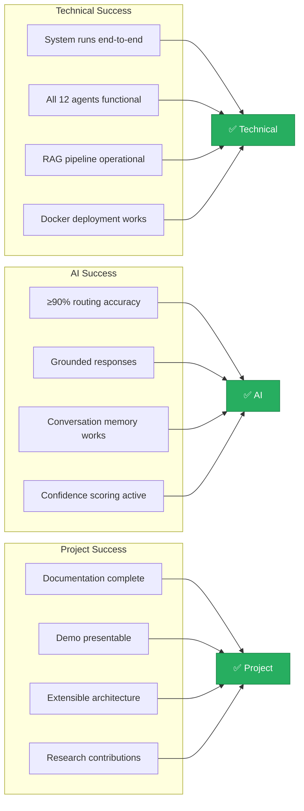

---

## 🔄 High-Level Workflow

### User Query Flow

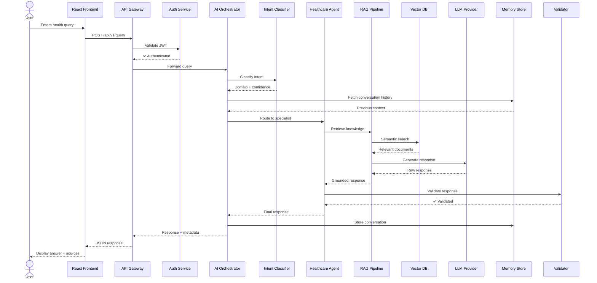

### System Startup Flow

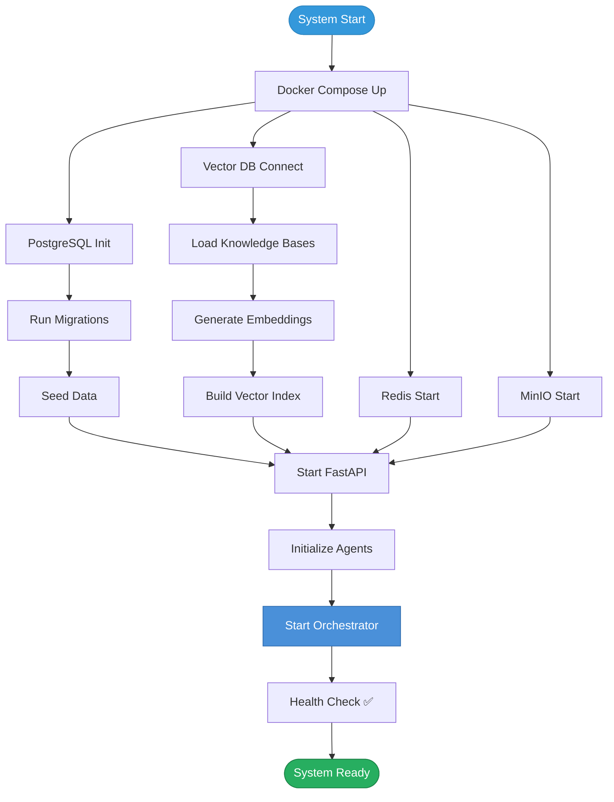

---

## 📌 Conclusion

MediOrchestrator AI demonstrates that healthcare AI can be **specialized**, **accurate**, and **transparent**. By replacing monolithic chatbot architectures with a multi-agent orchestration system, we address the fundamental limitations of current healthcare AI solutions.

### Key Differentiators

| Aspect | Our Approach |
|---|---|
| **Architecture** | Agentic, not monolithic |
| **Knowledge** | RAG-grounded, not hallucinated |
| **Specialization** | 12 domain agents, not generic |
| **Intelligence** | Orchestrated routing, not random |
| **Memory** | Persistent context, not stateless |
| **Validation** | Confidence-scored, not blind |
| **Extensibility** | Plugin-based, not hardcoded |

> [!TIP]
> Continue to [System Architecture & Design](02_System_Architecture_and_Design.md) for the complete technical architecture.

---

**MediOrchestrator AI** — *Where AI Agents Meet Healthcare Intelligence*

