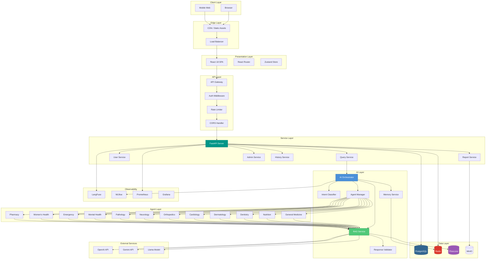
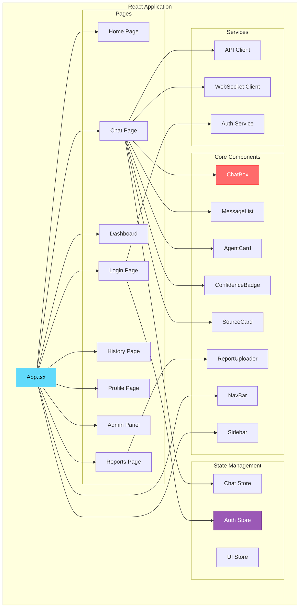
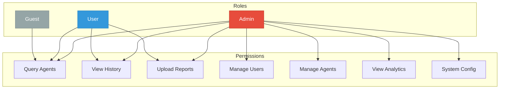
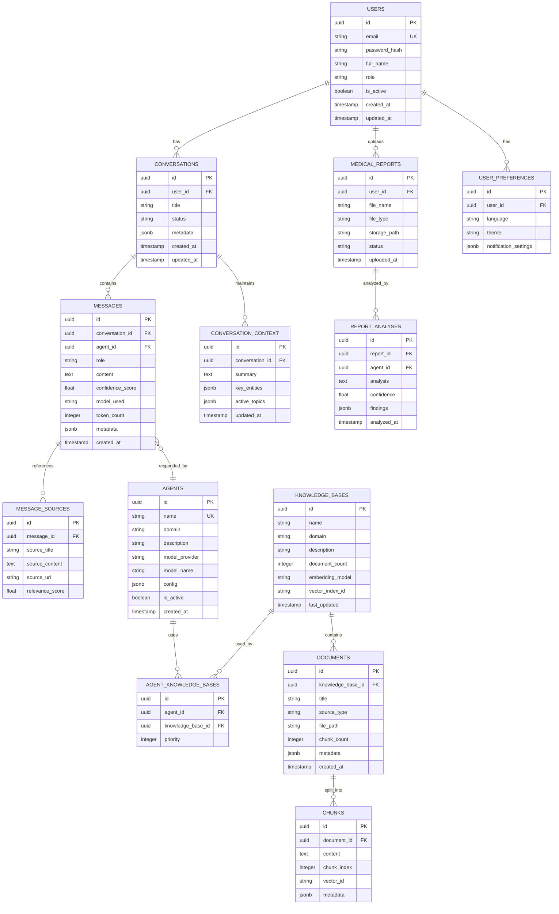
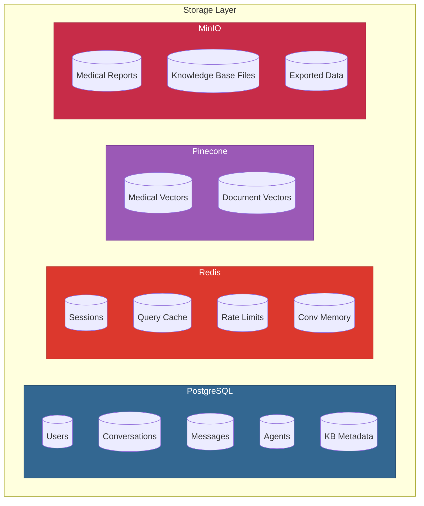
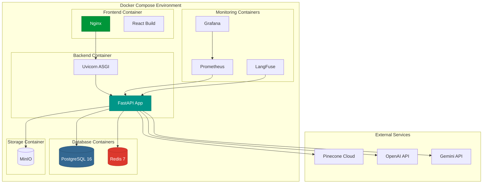
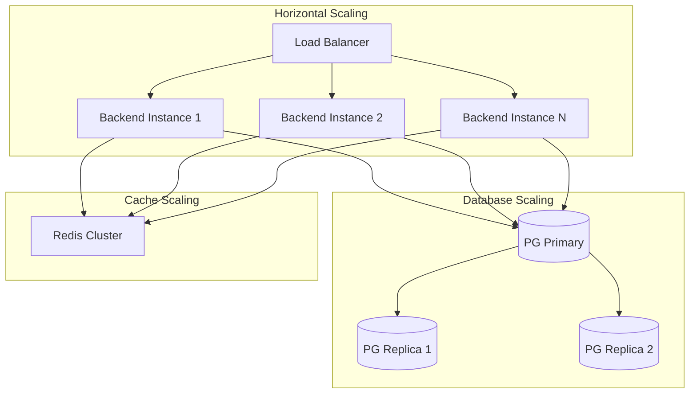
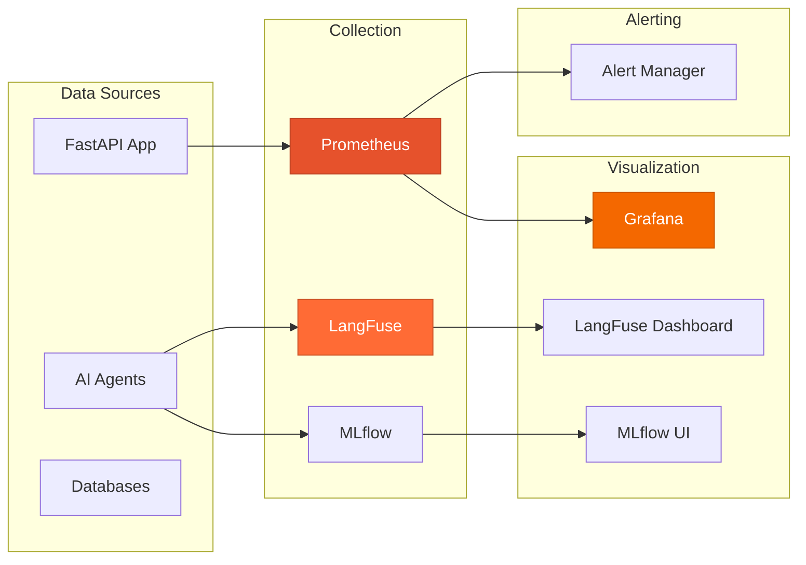
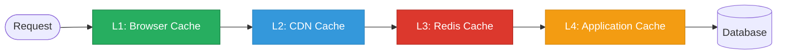

<div align="center">

#  System Architecture & Design

## MediOrchestrator AI

**Complete Technical Architecture Documentation**

</div>

---

## Table of Contents

- [Complete Architecture Overview](#-complete-architecture-overview)
- [Frontend Architecture](#-frontend-architecture)
- [Backend Architecture](#-backend-architecture)
- [Authentication & Authorization](#-authentication--authorization)
- [Database Architecture](#-database-architecture)
- [Storage Architecture](#-storage-architecture)
- [API Architecture](#-api-architecture)
- [ER Diagram](#-er-diagram)
- [Folder Structure](#-folder-structure)
- [Deployment Architecture](#-deployment-architecture)
- [Scalability](#-scalability)
- [Monitoring & Observability](#-monitoring--observability)
- [Caching Strategy](#-caching-strategy)
- [Sequence Diagrams](#-sequence-diagrams)

---

##  Complete Architecture Overview

### System Architecture



### Architecture Layers Summary

| Layer | Components | Responsibility |
|---|---|---|
| **Client** | Browser, Mobile Web | User interface rendering |
| **Edge** | CDN, Load Balancer | Static assets, traffic distribution |
| **Presentation** | React, Router, State | SPA, navigation, state management |
| **API** | Gateway, Auth, Rate Limiter | Request handling, security, throttling |
| **Service** | FastAPI, Domain Services | Business logic, API endpoints |
| **AI** | Orchestrator, RAG, Memory | AI orchestration, knowledge retrieval |
| **Agent** | 12 Healthcare Agents | Domain-specific medical processing |
| **Data** | PostgreSQL, Redis, Pinecone, MinIO | Persistence, caching, vectors, files |
| **External** | OpenAI, Gemini, Llama | LLM inference providers |
| **Observability** | LangFuse, MLflow, Prometheus | Monitoring, tracing, metrics |

---

##  Frontend Architecture

### Component Architecture



### Frontend Technology Stack

| Technology | Purpose | Version |
|---|---|---|
| React | UI framework | 18.x |
| Vite | Build tool | 5.x |
| React Router | Navigation | 6.x |
| Zustand | State management | 4.x |
| React Query | Server state / caching | 5.x |
| Tailwind CSS | Utility-first styling | 3.x |
| Axios | HTTP client | 1.x |
| React Markdown | Render AI responses | Latest |
| Framer Motion | Animations | Latest |
| Lucide React | Icons | Latest |

### Frontend Data Flow


---

##  Backend Architecture

### Backend Service Architecture

```mermaid
graph TB
    subgraph "FastAPI Application"
        Main[main.py]
        
        subgraph "API Routers"
            AuthRouter[/auth]
            QueryRouter[/query]
            UserRouter[/users]
            ReportRouter[/reports]
            HistoryRouter[/history]
            AdminRouter[/admin]
            HealthRouter[/health]
            AgentRouter[/agents]
        end

        subgraph "Middleware"
            CORSMiddleware[CORS]
            AuthMiddleware[JWT Auth]
            RateLimitMiddleware[Rate Limiter]
            LoggingMiddleware[Request Logger]
            ErrorMiddleware[Error Handler]
        end

        subgraph "Services"
            QueryService[Query Service]
            AuthService[Auth Service]
            UserService[User Service]
            ReportService[Report Service]
            HistoryService[History Service]
            AgentService[Agent Service]
        end

        subgraph "Core"
            Config[Configuration]
            Database[DB Connection]
            Security[Security Utils]
            Dependencies[Dependencies]
        end
    end

    Main --> CORSMiddleware --> AuthMiddleware --> RateLimitMiddleware --> LoggingMiddleware --> ErrorMiddleware
    Main --> AuthRouter & QueryRouter & UserRouter & ReportRouter & HistoryRouter & AdminRouter & HealthRouter & AgentRouter
    QueryRouter --> QueryService
    AuthRouter --> AuthService
    UserRouter --> UserService
    ReportRouter --> ReportService
    HistoryRouter --> HistoryService
    AgentRouter --> AgentService
    QueryService & AuthService & UserService --> Database
    AuthService --> Security
    Main --> Config & Dependencies

    style Main fill:#009688,stroke:#00796B,color:#fff
    style QueryService fill:#4A90D9,stroke:#2E6BAE,color:#fff
```

### Request Lifecycle


### Backend Technology Stack

| Technology | Purpose |
|---|---|
| **FastAPI** | Async web framework, auto-docs |
| **Uvicorn** | ASGI server |
| **Pydantic v2** | Data validation, serialization |
| **SQLAlchemy 2.0** | ORM, database queries |
| **Alembic** | Database migrations |
| **python-jose** | JWT token handling |
| **Passlib + bcrypt** | Password hashing |
| **python-multipart** | File upload handling |
| **httpx** | Async HTTP client |
| **celery** | Background task processing |

---

##  Authentication & Authorization

### Authentication Flow


### Authorization Model



| Role | Permissions | Description |
|---|---|---|
| **Admin** | Full access | System management, user management, analytics |
| **User** | Query, History, Reports | Standard authenticated user |
| **Guest** | Limited queries | Unauthenticated, rate-limited access |

### JWT Token Structure

```json
{
  "header": {
    "alg": "HS256",
    "typ": "JWT"
  },
  "payload": {
    "sub": "user_id_uuid",
    "email": "user@example.com",
    "role": "user",
    "iat": 1700000000,
    "exp": 1700003600
  }
}
```

| Token Type | Lifetime | Storage |
|---|---|---|
| Access Token | 1 hour | Memory (frontend) |
| Refresh Token | 7 days | HttpOnly cookie + Redis |

---

##  Database Architecture

### Database Schema Overview



### Table Specifications

#### Users Table

| Field | Type | Constraints | Description |
|---|---|---|---|
| `id` | UUID | PK, auto-generated | Unique user identifier |
| `email` | VARCHAR(255) | UNIQUE, NOT NULL | User email (login credential) |
| `password_hash` | VARCHAR(255) | NOT NULL | bcrypt hashed password |
| `full_name` | VARCHAR(100) | NOT NULL | Display name |
| `role` | VARCHAR(20) | NOT NULL, DEFAULT 'user' | user / admin / guest |
| `is_active` | BOOLEAN | DEFAULT true | Account status |
| `created_at` | TIMESTAMP | DEFAULT NOW() | Registration timestamp |
| `updated_at` | TIMESTAMP | ON UPDATE | Last modification |

**Indexes:** `idx_users_email` (UNIQUE), `idx_users_role`

---

#### Conversations Table

| Field | Type | Constraints | Description |
|---|---|---|---|
| `id` | UUID | PK | Conversation identifier |
| `user_id` | UUID | FK → users.id | Conversation owner |
| `title` | VARCHAR(255) | | Auto-generated title |
| `status` | VARCHAR(20) | DEFAULT 'active' | active / archived / deleted |
| `metadata` | JSONB | | Additional conversation data |
| `created_at` | TIMESTAMP | DEFAULT NOW() | Creation time |
| `updated_at` | TIMESTAMP | | Last activity |

**Indexes:** `idx_conversations_user_id`, `idx_conversations_status`

---

#### Messages Table

| Field | Type | Constraints | Description |
|---|---|---|---|
| `id` | UUID | PK | Message identifier |
| `conversation_id` | UUID | FK → conversations.id | Parent conversation |
| `agent_id` | UUID | FK → agents.id, NULLABLE | Responding agent (null for user messages) |
| `role` | VARCHAR(20) | NOT NULL | user / assistant / system |
| `content` | TEXT | NOT NULL | Message content |
| `confidence_score` | FLOAT | NULLABLE | AI confidence (0.0 - 1.0) |
| `model_used` | VARCHAR(50) | NULLABLE | LLM model identifier |
| `token_count` | INTEGER | | Token usage |
| `metadata` | JSONB | | Model params, latency, etc. |
| `created_at` | TIMESTAMP | DEFAULT NOW() | Message timestamp |

**Indexes:** `idx_messages_conversation_id`, `idx_messages_created_at`

---

#### Agents Table

| Field | Type | Constraints | Description |
|---|---|---|---|
| `id` | UUID | PK | Agent identifier |
| `name` | VARCHAR(100) | UNIQUE | Agent name (e.g., `cardiology_agent`) |
| `domain` | VARCHAR(50) | NOT NULL | Healthcare domain |
| `description` | TEXT | | Agent purpose description |
| `model_provider` | VARCHAR(50) | | openai / google / meta |
| `model_name` | VARCHAR(100) | | gpt-4 / gemini-pro / llama-3 |
| `config` | JSONB | | Temperature, max_tokens, etc. |
| `is_active` | BOOLEAN | DEFAULT true | Agent availability |
| `created_at` | TIMESTAMP | DEFAULT NOW() | Creation time |

**Indexes:** `idx_agents_domain`, `idx_agents_is_active`

---

#### Knowledge Bases Table

| Field | Type | Constraints | Description |
|---|---|---|---|
| `id` | UUID | PK | Knowledge base identifier |
| `name` | VARCHAR(100) | | Knowledge base name |
| `domain` | VARCHAR(50) | | Medical domain |
| `description` | TEXT | | Content description |
| `document_count` | INTEGER | DEFAULT 0 | Number of documents |
| `embedding_model` | VARCHAR(100) | | Model used for embeddings |
| `vector_index_id` | VARCHAR(100) | | Pinecone index identifier |
| `last_updated` | TIMESTAMP | | Last content update |

---

### Database Design Principles

| Principle | Implementation |
|---|---|
| **Normalization** | 3NF for transactional data |
| **UUID Primary Keys** | Distributed-safe identifiers |
| **JSONB Fields** | Flexible metadata without schema changes |
| **Soft Deletes** | Status field instead of hard deletes |
| **Audit Columns** | `created_at`, `updated_at` on every table |
| **Indexing Strategy** | B-tree for lookups, GIN for JSONB |
| **Foreign Keys** | Referential integrity enforced |

---

##  Storage Architecture



| Store | Type | Data | TTL |
|---|---|---|---|
| **PostgreSQL** | Relational | Users, conversations, agents, KB metadata | Permanent |
| **Redis** | Key-Value | Sessions, cache, rate limits, active memory | 1h–7d |
| **Pinecone** | Vector | Medical embeddings, document chunks | Permanent |
| **MinIO** | Object | Reports, PDFs, KB source files | Permanent |

---

##  API Architecture

### API Design Principles

| Principle | Implementation |
|---|---|
| **RESTful** | Resource-based URLs, proper HTTP methods |
| **Versioned** | `/api/v1/` prefix for all routes |
| **Documented** | Auto-generated OpenAPI (Swagger) |
| **Consistent** | Standard response envelope |
| **Paginated** | Cursor-based pagination for lists |

### API Endpoints

#### Authentication

| Method | Endpoint | Description | Auth |
|---|---|---|---|
| POST | `/api/v1/auth/register` | Register new user |  |
| POST | `/api/v1/auth/login` | Login, get tokens |  |
| POST | `/api/v1/auth/refresh` | Refresh access token |  Refresh |
| POST | `/api/v1/auth/logout` | Invalidate tokens |  |
| GET | `/api/v1/auth/me` | Get current user |  |

#### Query & Chat

| Method | Endpoint | Description | Auth |
|---|---|---|---|
| POST | `/api/v1/query` | Submit health query |  |
| POST | `/api/v1/query/stream` | Stream response (SSE) |  |
| GET | `/api/v1/query/{id}` | Get query result |  |

#### Conversations

| Method | Endpoint | Description | Auth |
|---|---|---|---|
| GET | `/api/v1/conversations` | List conversations |  |
| GET | `/api/v1/conversations/{id}` | Get conversation |  |
| DELETE | `/api/v1/conversations/{id}` | Delete conversation |  |
| GET | `/api/v1/conversations/{id}/messages` | Get messages |  |

#### Reports

| Method | Endpoint | Description | Auth |
|---|---|---|---|
| POST | `/api/v1/reports/upload` | Upload medical report |  |
| GET | `/api/v1/reports` | List user reports |  |
| GET | `/api/v1/reports/{id}/analysis` | Get analysis |  |

#### Agents

| Method | Endpoint | Description | Auth |
|---|---|---|---|
| GET | `/api/v1/agents` | List all agents |  |
| GET | `/api/v1/agents/{id}` | Get agent details |  |
| GET | `/api/v1/agents/{id}/status` | Agent health status |  Admin |

#### Admin

| Method | Endpoint | Description | Auth |
|---|---|---|---|
| GET | `/api/v1/admin/users` | List users |  Admin |
| GET | `/api/v1/admin/analytics` | System analytics |  Admin |
| PUT | `/api/v1/admin/agents/{id}` | Update agent config |  Admin |
| GET | `/api/v1/admin/system/health` | System health check |  Admin |

#### System

| Method | Endpoint | Description | Auth |
|---|---|---|---|
| GET | `/api/v1/health` | Health check |  |
| GET | `/api/v1/health/ready` | Readiness probe |  |
| GET | `/docs` | Swagger UI |  |

### Standard Response Format

```json
{
  "success": true,
  "data": {
    "response": "Based on the symptoms described...",
    "agent": "cardiology_agent",
    "confidence": 0.92,
    "sources": [
      {
        "title": "ACC/AHA Heart Failure Guidelines",
        "relevance": 0.95
      }
    ],
    "model": "gpt-4",
    "tokens_used": 847,
    "latency_ms": 2340
  },
  "metadata": {
    "request_id": "req_abc123",
    "timestamp": "2024-01-15T10:30:00Z",
    "version": "1.0.0"
  }
}
```

### Error Response Format

```json
{
  "success": false,
  "error": {
    "code": "VALIDATION_ERROR",
    "message": "Query text is required",
    "details": [
      {
        "field": "query",
        "issue": "Field cannot be empty"
      }
    ]
  },
  "metadata": {
    "request_id": "req_xyz789",
    "timestamp": "2024-01-15T10:30:00Z"
  }
}
```

---

##  Folder Structure

### Backend Structure

```
backend/
├── app/
│   ├── __init__.py
│   ├── main.py                     # FastAPI application entry
│   ├── config.py                   # Environment configuration
│   │
│   ├── api/
│   │   ├── __init__.py
│   │   ├── deps.py                 # Dependency injection
│   │   └── v1/
│   │       ├── __init__.py
│   │       ├── auth.py             # Auth endpoints
│   │       ├── query.py            # Query endpoints
│   │       ├── conversations.py    # Conversation endpoints
│   │       ├── reports.py          # Report endpoints
│   │       ├── agents.py           # Agent endpoints
│   │       ├── admin.py            # Admin endpoints
│   │       └── health.py           # Health check endpoints
│   │
│   ├── core/
│   │   ├── __init__.py
│   │   ├── security.py             # JWT, hashing, auth utils
│   │   ├── database.py             # DB connection, session
│   │   ├── redis.py                # Redis connection
│   │   └── exceptions.py           # Custom exceptions
│   │
│   ├── models/
│   │   ├── __init__.py
│   │   ├── user.py                 # User SQLAlchemy model
│   │   ├── conversation.py         # Conversation model
│   │   ├── message.py              # Message model
│   │   ├── agent.py                # Agent model
│   │   ├── knowledge_base.py       # Knowledge base model
│   │   ├── document.py             # Document model
│   │   └── report.py               # Medical report model
│   │
│   ├── schemas/
│   │   ├── __init__.py
│   │   ├── user.py                 # User Pydantic schemas
│   │   ├── query.py                # Query request/response
│   │   ├── conversation.py         # Conversation schemas
│   │   ├── agent.py                # Agent schemas
│   │   └── report.py               # Report schemas
│   │
│   ├── services/
│   │   ├── __init__.py
│   │   ├── auth_service.py         # Authentication logic
│   │   ├── user_service.py         # User management
│   │   ├── query_service.py        # Query processing
│   │   ├── conversation_service.py # Conversation management
│   │   ├── report_service.py       # Report handling
│   │   └── admin_service.py        # Admin operations
│   │
│   ├── agents/
│   │   ├── __init__.py
│   │   ├── orchestrator.py         # AI Orchestrator
│   │   ├── intent_classifier.py    # Intent classification
│   │   ├── agent_router.py         # Agent selection
│   │   ├── agent_manager.py        # Agent lifecycle
│   │   ├── base_agent.py           # Base agent class
│   │   ├── response_validator.py   # Response validation
│   │   └── domains/
│   │       ├── __init__.py
│   │       ├── general_medicine.py
│   │       ├── nutrition.py
│   │       ├── dentistry.py
│   │       ├── dermatology.py
│   │       ├── cardiology.py
│   │       ├── orthopedics.py
│   │       ├── neurology.py
│   │       ├── pathology.py
│   │       ├── mental_health.py
│   │       ├── emergency.py
│   │       ├── womens_health.py
│   │       └── pharmacy.py
│   │
│   ├── rag/
│   │   ├── __init__.py
│   │   ├── pipeline.py             # Main RAG pipeline
│   │   ├── retriever.py            # Document retriever
│   │   ├── embeddings.py           # Embedding service
│   │   ├── chunker.py              # Document chunking
│   │   ├── reranker.py             # Result reranking
│   │   └── vector_store.py         # Vector DB interface
│   │
│   ├── knowledge/
│   │   ├── __init__.py
│   │   ├── loader.py               # Knowledge base loader
│   │   ├── processor.py            # Document processor
│   │   └── datasets/
│   │       ├── general_medicine/
│   │       ├── nutrition/
│   │       ├── cardiology/
│   │       └── ...
│   │
│   └── memory/
│       ├── __init__.py
│       ├── conversation_memory.py  # Conversation context
│       ├── summary_memory.py       # Summarization
│       └── buffer_memory.py        # Buffer window memory
│
├── alembic/
│   ├── versions/                   # Migration files
│   └── env.py
│
├── tests/
│   ├── conftest.py
│   ├── test_auth.py
│   ├── test_query.py
│   ├── test_agents.py
│   └── test_rag.py
│
├── alembic.ini
├── requirements.txt
├── Dockerfile
└── .env.example
```

### Frontend Structure

```
frontend/
├── public/
│   └── index.html
├── src/
│   ├── main.tsx                    # Entry point
│   ├── App.tsx                     # Root component
│   │
│   ├── components/
│   │   ├── chat/
│   │   │   ├── ChatBox.tsx
│   │   │   ├── MessageBubble.tsx
│   │   │   ├── MessageList.tsx
│   │   │   ├── SourceCard.tsx
│   │   │   └── ConfidenceBadge.tsx
│   │   ├── layout/
│   │   │   ├── NavBar.tsx
│   │   │   ├── Sidebar.tsx
│   │   │   └── Footer.tsx
│   │   ├── agents/
│   │   │   ├── AgentCard.tsx
│   │   │   └── AgentList.tsx
│   │   ├── reports/
│   │   │   ├── ReportUploader.tsx
│   │   │   └── ReportViewer.tsx
│   │   └── common/
│   │       ├── Button.tsx
│   │       ├── Input.tsx
│   │       ├── Modal.tsx
│   │       └── Loading.tsx
│   │
│   ├── pages/
│   │   ├── Home.tsx
│   │   ├── Chat.tsx
│   │   ├── Dashboard.tsx
│   │   ├── Reports.tsx
│   │   ├── History.tsx
│   │   ├── Profile.tsx
│   │   ├── Login.tsx
│   │   ├── Register.tsx
│   │   └── Admin.tsx
│   │
│   ├── services/
│   │   ├── api.ts                  # Axios instance
│   │   ├── authService.ts          # Auth API calls
│   │   ├── queryService.ts         # Query API calls
│   │   └── reportService.ts        # Report API calls
│   │
│   ├── store/
│   │   ├── authStore.ts            # Auth state
│   │   ├── chatStore.ts            # Chat state
│   │   └── uiStore.ts              # UI state
│   │
│   ├── hooks/
│   │   ├── useAuth.ts
│   │   ├── useChat.ts
│   │   └── useAgents.ts
│   │
│   ├── types/
│   │   └── index.ts                # TypeScript types
│   │
│   └── utils/
│       ├── constants.ts
│       └── helpers.ts
│
├── tailwind.config.js
├── vite.config.ts
├── package.json
├── tsconfig.json
└── Dockerfile
```

---

##  Deployment Architecture

### Container Architecture



### Docker Compose Service Map

| Service | Image | Port | Depends On |
|---|---|---|---|
| `frontend` | node:18 → nginx | 3000 | backend |
| `backend` | python:3.11-slim | 8000 | postgres, redis, minio |
| `postgres` | postgres:16 | 5432 | — |
| `redis` | redis:7-alpine | 6379 | — |
| `minio` | minio/minio | 9000, 9001 | — |
| `prometheus` | prom/prometheus | 9090 | backend |
| `grafana` | grafana/grafana | 3001 | prometheus |
| `langfuse` | langfuse/langfuse | 3002 | postgres |

---

##  Scalability

### Scaling Strategy



| Component | Strategy | Trigger |
|---|---|---|
| **Backend** | Horizontal pod scaling | CPU > 70% |
| **PostgreSQL** | Read replicas | Query load > threshold |
| **Redis** | Cluster mode | Memory > 80% |
| **Vector DB** | Managed scaling (Pinecone) | Auto-managed |
| **Frontend** | CDN + edge caching | Always-on |

---

##  Monitoring & Observability

### Observability Stack



### Key Metrics

| Category | Metric | Target |
|---|---|---|
| **API** | Response latency (p99) | < 500ms |
| **AI** | Agent response time | < 3s |
| **AI** | Intent classification accuracy | ≥ 90% |
| **RAG** | Retrieval latency | < 200ms |
| **System** | Uptime | ≥ 99% |
| **DB** | Query execution time | < 100ms |
| **Cache** | Hit rate | ≥ 80% |
| **LLM** | Token cost per query | Tracked |

---

##  Caching Strategy

### Cache Layers



| Cache Layer | Data | TTL | Strategy |
|---|---|---|---|
| **Browser** | Static assets, API responses | 1h–24h | Cache-Control headers |
| **CDN** | JS, CSS, images | 7 days | Immutable with hash |
| **Redis** | Session, query cache, rate limits | 5min–7d | TTL-based eviction |
| **Application** | Agent configs, KB metadata | 30min | In-memory with refresh |

### Redis Cache Keys

| Key Pattern | Data | TTL |
|---|---|---|
| `session:{user_id}` | User session data | 1 hour |
| `query_cache:{hash}` | Cached query results | 15 minutes |
| `rate_limit:{ip}` | Rate limit counter | 1 minute |
| `agent_config:{agent_id}` | Agent configuration | 30 minutes |
| `conv_memory:{conv_id}` | Active conversation context | 2 hours |
| `refresh_token:{token_id}` | Refresh token validation | 7 days |

---

##  Sequence Diagrams

### Medical Report Upload & Analysis


### Multi-Agent Query Flow


---

> [!TIP]
> Continue to [AI & Agent Architecture](03_AI_and_Agent_Architecture.md) for deep-dive into the AI orchestration system, RAG pipeline, and agent design.

---

<div align="center">

**MediOrchestrator AI** — *System Architecture & Design*

</div>
