<div align="center">

# 🧠 AI & Agent Architecture

## MediOrchestrator AI

**Agentic AI, Orchestration, RAG, and Multi-Agent System Design**

</div>

---

## Table of Contents

- [Agentic AI Overview](#-agentic-ai-overview)
- [AI Orchestrator](#-ai-orchestrator)
- [LangGraph Workflow](#-langgraph-workflow)
- [LangChain Integration](#-langchain-integration)
- [Agent-to-Agent Communication](#-agent-to-agent-communication)
- [Healthcare Agents](#-healthcare-agents)
- [Knowledge Bases](#-knowledge-bases)
- [Embeddings](#-embeddings)
- [RAG Pipeline](#-rag-pipeline)
- [Prompt Engineering](#-prompt-engineering)
- [Evaluation & Metrics](#-evaluation--metrics)
- [Hallucination Reduction](#-hallucination-reduction)
- [Medical Datasets](#-medical-datasets)
- [AI Pipelines](#-ai-pipelines)
- [State Diagrams](#-state-diagrams)

---

## 🤖 Agentic AI Overview

### What is Agentic AI?

Agentic AI differs from traditional chatbots in one fundamental way — **agents make decisions, take actions, and collaborate**.

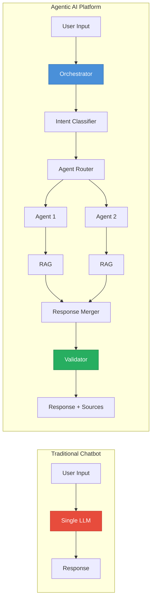

### Key Agentic Properties

| Property | Description | Implementation |
|---|---|---|
| **Autonomy** | Agents decide what actions to take | LangGraph state machines |
| **Specialization** | Each agent masters one domain | Domain-specific prompts + knowledge |
| **Collaboration** | Agents work together on complex queries | Multi-agent routing |
| **Memory** | Agents remember conversation context | Conversation memory store |
| **Tool Use** | Agents can use external tools | RAG retrieval, validation |
| **Reasoning** | Agents explain their decisions | Chain-of-thought prompting |

### Agentic Architecture Layers

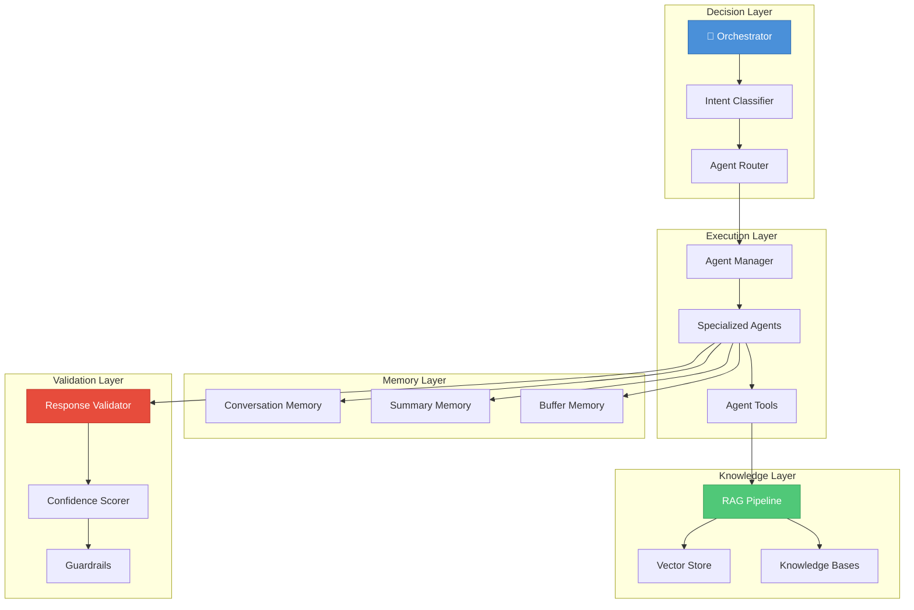

---

## 🧠 AI Orchestrator

The Orchestrator is the central intelligence that manages the entire query lifecycle.

### Orchestrator Responsibilities

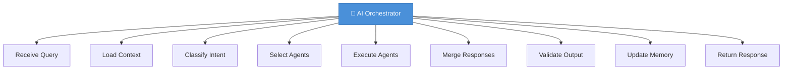

### Orchestrator Decision Flow

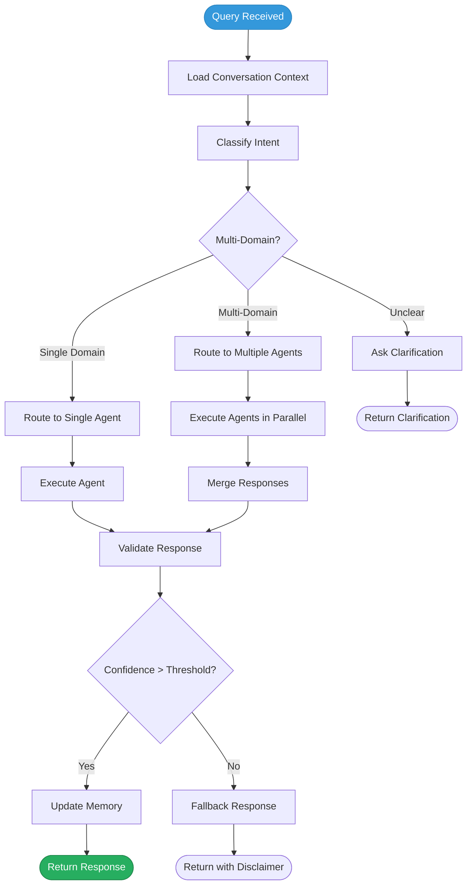

### Orchestrator Components

| Component | Purpose | Technology |
|---|---|---|
| **Query Receiver** | Parse and validate incoming queries | Pydantic validation |
| **Context Loader** | Fetch conversation history + user context | Redis + PostgreSQL |
| **Intent Classifier** | Determine medical domain(s) | LLM + classification prompt |
| **Agent Router** | Select appropriate agent(s) | Rule-based + ML routing |
| **Agent Executor** | Run selected agents | LangGraph execution |
| **Response Merger** | Combine multi-agent outputs | LLM-assisted merging |
| **Response Validator** | Check medical accuracy | Guardrails + confidence scoring |
| **Memory Updater** | Store conversation context | Redis + PostgreSQL |

---

## 🔗 LangGraph Workflow

### Why LangGraph?

| Feature | LangGraph | Plain LangChain | Custom Code |
|---|---|---|---|
| State machines | ✅ Built-in | ❌ | ⚠️ Complex |
| Conditional routing | ✅ Native | ⚠️ Limited | ⚠️ Complex |
| Parallel execution | ✅ Native | ❌ | ⚠️ Complex |
| Human-in-the-loop | ✅ Built-in | ❌ | ⚠️ Complex |
| Checkpointing | ✅ Built-in | ❌ | ❌ |
| Streaming | ✅ Native | ✅ | ⚠️ Complex |
| Visualization | ✅ Built-in | ❌ | ❌ |

### LangGraph Agent Workflow

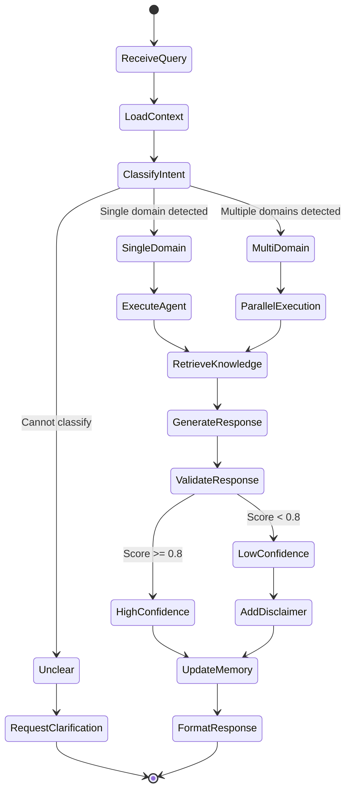

### LangGraph State Schema

```python
from typing import TypedDict, List, Optional
from langgraph.graph import StateGraph

class OrchestratorState(TypedDict):
    # Input
    query: str
    user_id: str
    conversation_id: str
    
    # Context
    conversation_history: List[dict]
    user_preferences: dict
    
    # Classification
    intent: str
    domains: List[str]
    confidence: float
    
    # Agent Execution
    selected_agents: List[str]
    agent_responses: List[dict]
    
    # RAG
    retrieved_documents: List[dict]
    
    # Output
    final_response: str
    sources: List[dict]
    response_confidence: float
    model_used: str
    tokens_used: int
    
    # Memory
    memory_updated: bool
```

### LangGraph Node Configuration

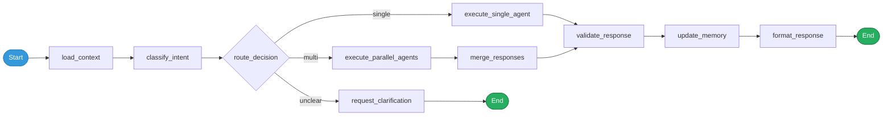

---

## ⛓ LangChain Integration

### LangChain Components Used

```mermaid
graph TB
    subgraph "LangChain Core"
        Prompts[Prompt Templates]
        Chains[Chains]
        OutputParsers[Output Parsers]
    end
    
    subgraph "LangChain Integrations"
        ChatModels[Chat Models]
        Embeddings[Embeddings]
        VectorStores[Vector Stores]
        DocLoaders[Document Loaders]
        TextSplitters[Text Splitters]
    end
    
    subgraph "LangChain Memory"
        ConvBuffer[ConversationBufferMemory]
        ConvSummary[ConversationSummaryMemory]
        VectorMemory[VectorStoreRetrieverMemory]
    end

    subgraph "Our Usage"
        AgentChains[Agent Chains]
        RAGChain[RAG Chain]
        ClassifierChain[Classifier Chain]
        ValidatorChain[Validator Chain]
    end

    Prompts & Chains & OutputParsers --> AgentChains & RAGChain & ClassifierChain & ValidatorChain
    ChatModels --> AgentChains
    Embeddings & VectorStores --> RAGChain
    ConvBuffer & ConvSummary --> AgentChains

    style AgentChains fill:#4A90D9,stroke:#2E6BAE,color:#fff
    style RAGChain fill:#50C878,stroke:#3DA35D,color:#fff
```

### LangChain Integration Points

| Component | LangChain Feature | Purpose |
|---|---|---|
| Intent Classifier | `ChatPromptTemplate` + `ChatOpenAI` | Classify query into medical domain |
| Agent Chains | `LLMChain` + domain prompts | Generate domain-specific responses |
| RAG Pipeline | `RetrievalQA` + `VectorStoreRetriever` | Retrieval-augmented generation |
| Embeddings | `OpenAIEmbeddings` / `HuggingFaceEmbeddings` | Text → vector conversion |
| Memory | `ConversationBufferWindowMemory` | Maintain conversation context |
| Output Parsing | `PydanticOutputParser` | Structure LLM outputs |
| Streaming | `StreamingStdOutCallbackHandler` | Real-time response streaming |

---

## 🔄 Agent-to-Agent Communication

### Communication Patterns

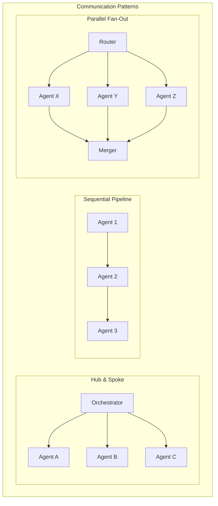

### Communication Protocol

| Pattern | When Used | Example |
|---|---|---|
| **Hub & Spoke** | Standard single-domain queries | User asks about diet → Nutrition agent |
| **Parallel Fan-Out** | Multi-domain queries | "Chest pain + anxiety" → Cardiology + Mental Health |
| **Sequential Pipeline** | Dependent processing | Upload report → Classify → Analyze → Summarize |
| **Escalation** | Low confidence scenarios | Nutrition agent → General Medicine for complex case |

### Multi-Agent Message Schema

```python
class AgentMessage:
    sender: str           # "orchestrator" or agent_id
    receiver: str         # Target agent_id
    message_type: str     # "query", "response", "escalation", "context"
    content: str          # Actual message
    context: dict         # Shared context (conversation history, user info)
    priority: int         # 1 (high) to 5 (low)
    metadata: dict        # Timestamps, token counts, etc.
```

### Agent Collaboration Sequence

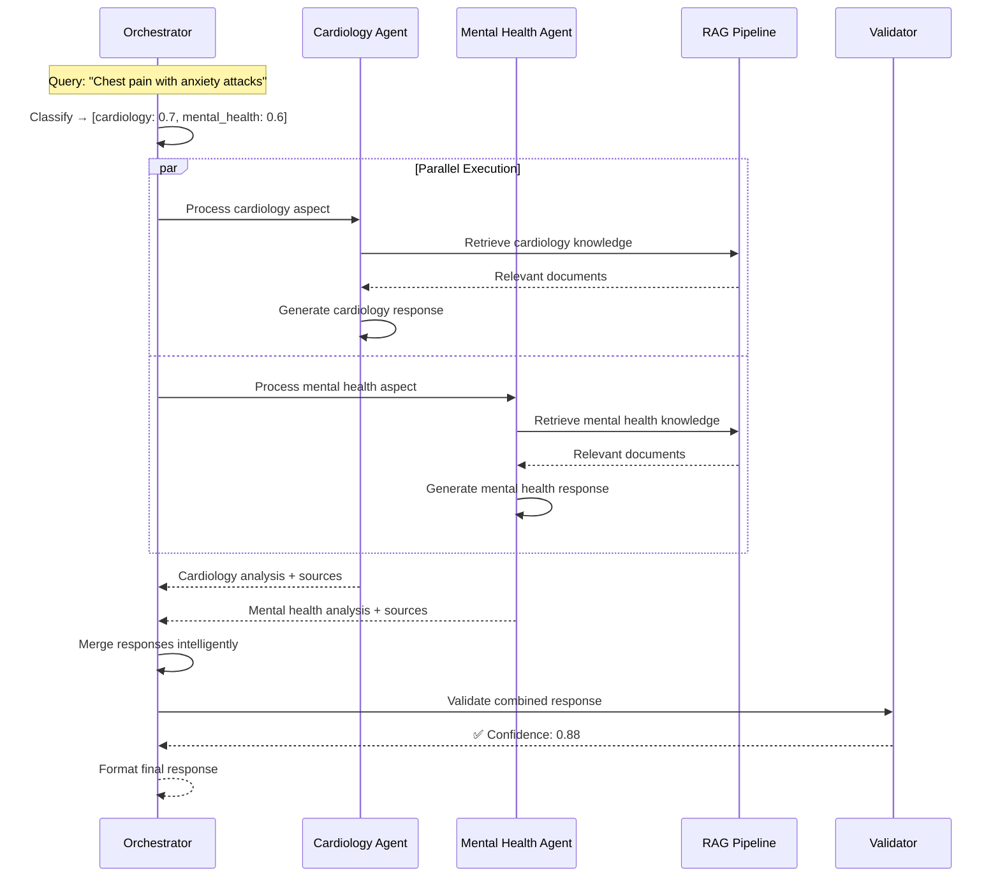

---

## 🏥 Healthcare Agents

### Agent Architecture

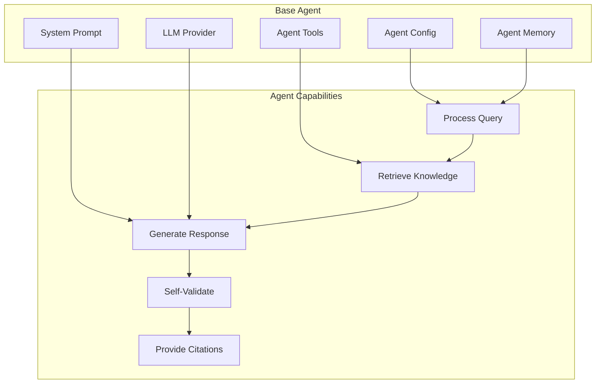

### Agent Configuration

| Agent | Domain | Primary Model | KB Size | Specialization |
|---|---|---|---|---|
| `general_medicine_agent` | General Medicine | GPT-4 | Large | Symptoms, diagnostics, general health |
| `nutrition_agent` | Nutrition | Gemini Pro | Medium | Diet plans, nutritional science, food |
| `dentistry_agent` | Dentistry | GPT-4 | Medium | Oral health, dental procedures |
| `dermatology_agent` | Dermatology | GPT-4 | Medium | Skin conditions, treatments |
| `cardiology_agent` | Cardiology | GPT-4 | Large | Heart health, cardiovascular |
| `orthopedics_agent` | Orthopedics | Gemini Pro | Medium | Bones, joints, rehabilitation |
| `neurology_agent` | Neurology | GPT-4 | Large | Brain, nervous system |
| `pathology_agent` | Pathology | GPT-4 | Medium | Lab results, diagnostic testing |
| `mental_health_agent` | Mental Health | GPT-4 | Large | Psychology, therapy, wellness |
| `emergency_agent` | Emergency | GPT-4 | Medium | Triage, emergency protocols |
| `womens_health_agent` | Women's Health | Gemini Pro | Medium | Gynecology, reproductive health |
| `pharmacy_agent` | Pharmacy | GPT-4 | Large | Drug interactions, medications |

### Agent Base Class

```python
class BaseHealthcareAgent:
    """Base class for all healthcare agents."""
    
    def __init__(self, config: AgentConfig):
        self.name = config.name
        self.domain = config.domain
        self.llm = self._init_llm(config.model_provider, config.model_name)
        self.knowledge_base = self._load_knowledge_base(config.kb_ids)
        self.system_prompt = self._load_system_prompt(config.domain)
        self.memory = ConversationBufferWindowMemory(k=10)
        self.retriever = self._init_retriever(config.vector_index)
    
    async def process_query(
        self, 
        query: str, 
        context: ConversationContext
    ) -> AgentResponse:
        """Main query processing pipeline."""
        # 1. Retrieve relevant knowledge
        documents = await self.retriever.retrieve(query)
        
        # 2. Build prompt with context
        prompt = self._build_prompt(query, context, documents)
        
        # 3. Generate response
        response = await self.llm.agenerate(prompt)
        
        # 4. Validate and score confidence
        validated = self._validate(response, documents)
        
        # 5. Format with citations
        return self._format_response(validated, documents)
```

### Agent Extensibility Pattern

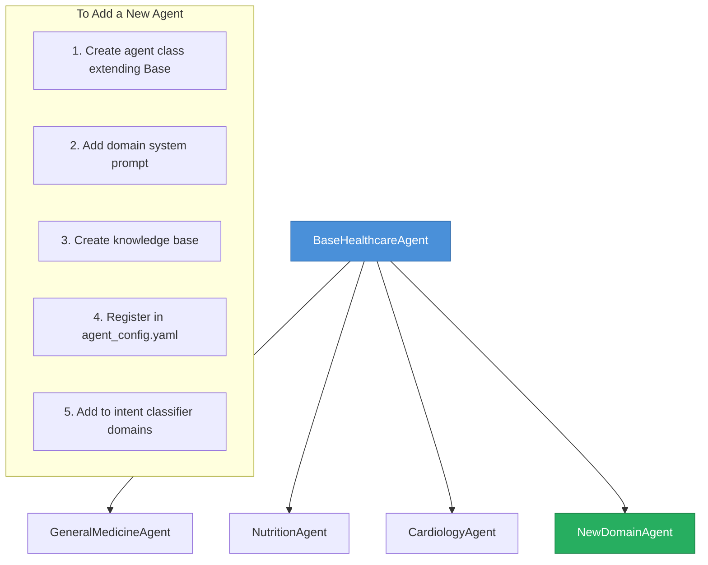

> [!TIP]
> Adding a new agent requires **5 steps** — no changes to the orchestrator core. This is the power of the plugin architecture.

---

## 📚 Knowledge Bases

### Knowledge Base Architecture

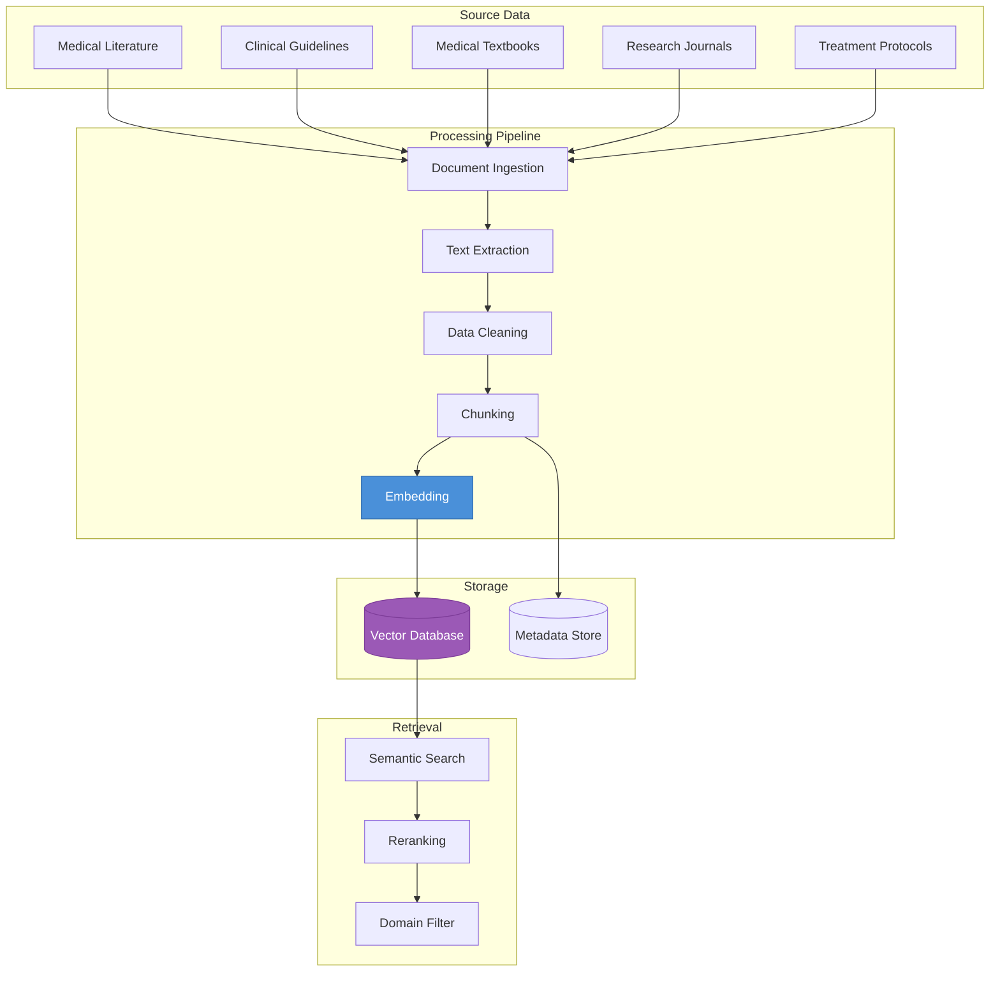

### Knowledge Base per Domain

| Domain | Sources | Doc Types | Update Frequency |
|---|---|---|---|
| General Medicine | WHO, CDC, Merck Manual | Guidelines, Protocols | Quarterly |
| Nutrition | USDA, WHO Nutrition | Dietary guides, Studies | Monthly |
| Dentistry | ADA Guidelines | Procedures, Care guides | Quarterly |
| Dermatology | AAD, DermNet | Condition databases | Quarterly |
| Cardiology | ACC/AHA Guidelines | Clinical guidelines | Quarterly |
| Orthopedics | AAOS Guidelines | Treatment protocols | Bi-annual |
| Neurology | AAN Guidelines | Clinical summaries | Quarterly |
| Pathology | CAP Guidelines | Lab references | Bi-annual |
| Mental Health | DSM-5, APA | Diagnostic criteria | Annual |
| Emergency | ACLS, ATLS | Triage protocols | Annual |
| Women's Health | ACOG Guidelines | Clinical guidelines | Quarterly |
| Pharmacy | FDA, DrugBank | Drug databases | Monthly |

---

## 🔢 Embeddings

### Embedding Pipeline

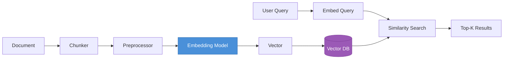

### Embedding Model Comparison

| Model | Dimensions | Speed | Medical Quality | Cost |
|---|---|---|---|---|
| `text-embedding-3-small` | 1536 | Fast | Good | Low |
| `text-embedding-3-large` | 3072 | Medium | Better | Medium |
| `text-embedding-ada-002` | 1536 | Fast | Good | Low |
| `all-MiniLM-L6-v2` | 384 | Very Fast | Moderate | Free |
| `pubmedbert-base` | 768 | Medium | Excellent | Free |
| `BioGPT-embeddings` | 1024 | Slow | Excellent | Free |

> [!NOTE]
> For medical domain, `pubmedbert-base` or `BioGPT-embeddings` offer superior quality for medical text. `text-embedding-3-small` provides a good balance of cost and quality.

### Chunking Strategy

| Strategy | Chunk Size | Overlap | Best For |
|---|---|---|---|
| **Recursive Character** | 1000 chars | 200 chars | General documents |
| **Semantic** | Variable | By meaning | Medical literature |
| **Markdown Header** | By section | — | Structured guides |
| **Sentence** | By sentence | 2 sentences | Short-form content |

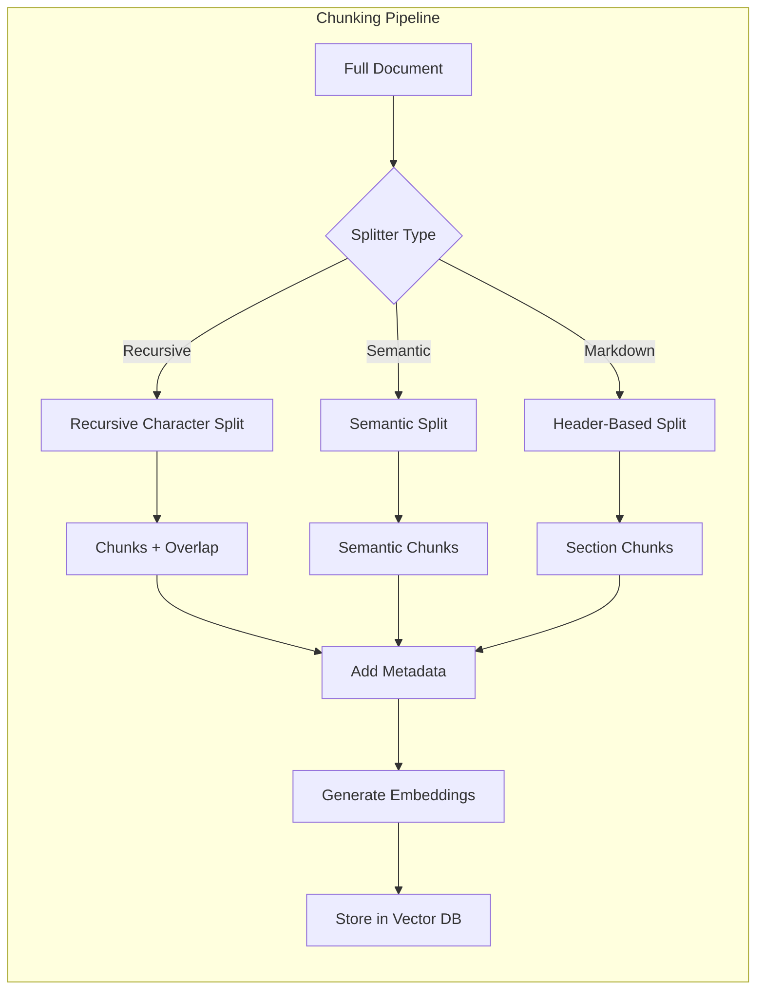

---

## 📖 RAG Pipeline

### RAG Architecture

```mermaid
graph TB
    subgraph "RAG Pipeline"
        Query[User Query]
        
        subgraph "Retrieval"
            QEmbed[Query Embedding]
            VSearch[Vector Search]
            KeySearch[Keyword Search]
            Hybrid[Hybrid Merge]
            Rerank[Reranker]
            Filter[Domain Filter]
        end
        
        subgraph "Augmentation"
            Context[Build Context]
            Prompt[Construct Prompt]
            Compress[Context Compression]
        end
        
        subgraph "Generation"
            LLM[LLM]
            Stream[Stream Response]
        end
        
        subgraph "Post-Processing"
            Validate[Validate]
            Score[Confidence Score]
            Cite[Add Citations]
        end
    end

    Query --> QEmbed --> VSearch --> Hybrid
    Query --> KeySearch --> Hybrid
    Hybrid --> Rerank --> Filter
    Filter --> Context --> Compress --> Prompt
    Prompt --> LLM --> Stream
    Stream --> Validate --> Score --> Cite

    style Query fill:#3498DB,stroke:#2E86C1,color:#fff
    style LLM fill:#E74C3C,stroke:#C0392B,color:#fff
    style Cite fill:#27AE60,stroke:#1E8449,color:#fff
```

### RAG Pipeline Stages

| Stage | Purpose | Technology |
|---|---|---|
| **Query Embedding** | Convert query to vector | OpenAI / PubMedBERT |
| **Vector Search** | Find similar document chunks | Pinecone cosine similarity |
| **Keyword Search** | BM25 lexical matching | Elasticsearch / Custom |
| **Hybrid Merge** | Combine semantic + keyword results | Reciprocal Rank Fusion |
| **Reranking** | Reorder by relevance | Cross-encoder reranker |
| **Domain Filter** | Filter by medical domain | Metadata filtering |
| **Context Compression** | Remove irrelevant passages | LLM-based compression |
| **Prompt Construction** | Build augmented prompt | LangChain templates |
| **Generation** | Generate grounded response | GPT-4 / Gemini |
| **Validation** | Check factual consistency | NLI model / Guardrails |
| **Confidence Scoring** | Rate response reliability | Heuristic + model-based |
| **Citation** | Link claims to sources | Source mapping |

### RAG Configuration

```python
rag_config = {
    "retrieval": {
        "top_k": 5,
        "similarity_threshold": 0.75,
        "search_type": "hybrid",           # "semantic", "keyword", "hybrid"
        "reranker": "cross-encoder",
        "domain_filter": True,
    },
    "augmentation": {
        "max_context_tokens": 4000,
        "compression": True,
        "include_metadata": True,
    },
    "generation": {
        "model": "gpt-4",
        "temperature": 0.3,                # Low for medical accuracy
        "max_tokens": 2000,
        "stream": True,
    },
    "validation": {
        "confidence_threshold": 0.7,
        "hallucination_check": True,
        "source_verification": True,
    }
}
```

### Knowledge Retrieval Pipeline

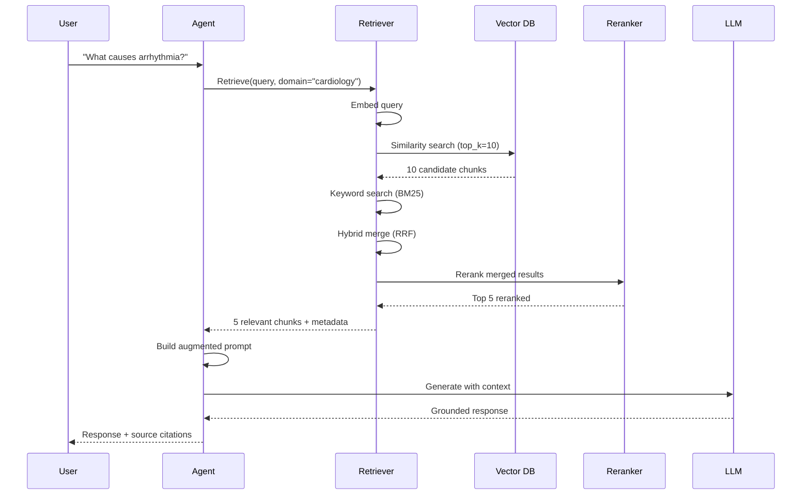

---

## 📝 Prompt Engineering

### Prompt Architecture

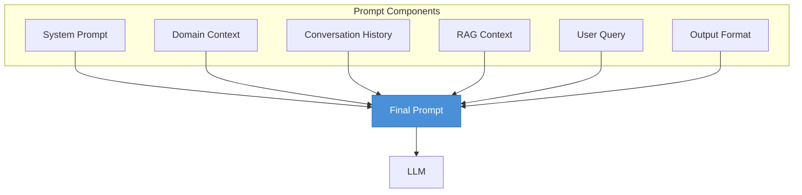

### System Prompt Template

```
You are {agent_name}, a specialized healthcare AI assistant for {domain}.

## Role
- Provide accurate, evidence-based information about {domain}
- Ground all responses in provided knowledge context
- Cite specific sources for medical claims
- Express uncertainty when knowledge is insufficient

## Rules
- NEVER diagnose conditions or prescribe medications
- ALWAYS recommend consulting healthcare professionals
- If the query is outside {domain}, indicate this clearly
- Provide confidence level (HIGH / MEDIUM / LOW) for each response
- Use simple language understandable by general public

## Knowledge Context
{rag_context}

## Conversation History
{conversation_history}

## Output Format
Respond in this structure:
1. Direct answer to the question
2. Supporting explanation (2-3 short paragraphs maximum)
3. Key points as bullet list
4. Sources referenced
5. Confidence level
6. "Consult a healthcare professional" reminder
```

### Prompt Strategies per Agent

| Agent | Temperature | Max Tokens | Special Instructions |
|---|---|---|---|
| General Medicine | 0.3 | 2000 | Broad coverage, balanced |
| Emergency | 0.1 | 1000 | Concise, urgent tone, triage focus |
| Mental Health | 0.5 | 2500 | Empathetic, supportive tone |
| Pharmacy | 0.1 | 1500 | Precise, include contraindications |
| Nutrition | 0.4 | 2000 | Practical, actionable advice |
| Pathology | 0.2 | 1500 | Technical, lab-focused |

### Prompt Optimization Techniques

| Technique | Purpose | Implementation |
|---|---|---|
| **Few-Shot Examples** | Guide output format | 2-3 domain examples in prompt |
| **Chain-of-Thought** | Improve reasoning | "Think step by step" instruction |
| **Role Prompting** | Establish expertise | "You are a specialist in..." |
| **Output Constraints** | Structure responses | JSON / structured output format |
| **Context Compression** | Stay within token limits | Summarize long conversations |
| **Guardrail Instructions** | Prevent harmful outputs | Explicit safety rules in prompt |

---

## 📊 Evaluation & Metrics

### Evaluation Framework

```mermaid
graph TB
    subgraph "Evaluation Dimensions"
        subgraph "Retrieval Quality"
            R1[Precision@K]
            R2[Recall@K]
            R3[MRR]
            R4[NDCG]
        end

        subgraph "Generation Quality"
            G1[Faithfulness]
            G2[Relevance]
            G3[Completeness]
            G4[Coherence]
        end

        subgraph "System Quality"
            S1[Latency]
            S2[Throughput]
            S3[Cost per Query]
            S4[Uptime]
        end

        subgraph "Medical Quality"
            M1[Accuracy]
            M2[Safety]
            M3[Source Grounding]
            M4[Hallucination Rate]
        end
    end
```

### Key Evaluation Metrics

| Metric | Formula / Definition | Target |
|---|---|---|
| **Faithfulness** | % of claims supported by retrieved docs | ≥ 95% |
| **Answer Relevance** | Semantic similarity of answer to query | ≥ 0.85 |
| **Context Precision** | Relevant chunks / Total retrieved | ≥ 80% |
| **Context Recall** | Found relevant / All relevant | ≥ 85% |
| **Hallucination Rate** | Unsupported claims / Total claims | ≤ 5% |
| **Routing Accuracy** | Correct agent / Total queries | ≥ 90% |
| **Response Latency** | Time from query to response | < 3s |

### Evaluation Tools

| Tool | Purpose | Integration |
|---|---|---|
| **RAGAS** | RAG evaluation framework | Automated metrics |
| **LangFuse** | LLM observability, tracing | Production monitoring |
| **MLflow** | Experiment tracking | A/B testing models |
| **Human Eval** | Expert review | Periodic quality checks |

---

## 🛡 Hallucination Reduction

### Multi-Layer Hallucination Prevention

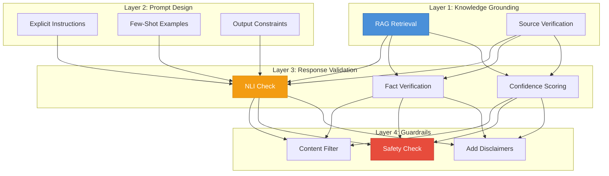

### Hallucination Prevention Strategies

| Layer | Strategy | Implementation |
|---|---|---|
| **Grounding** | Only use RAG-retrieved context | Retrieval-only generation |
| **Prompting** | "Only answer from provided context" | System prompt constraint |
| **Temperature** | Low temperature (0.1–0.3) | Reduce creative generation |
| **NLI Check** | Natural Language Inference | Verify claims against sources |
| **Confidence** | Score each response | Reject below threshold |
| **Abstention** | "I don't have information about..." | Teach model to say "I don't know" |
| **Citation** | Force source references | Every claim maps to a document |
| **Guardrails** | Content filtering | Block harmful / unsupported content |

---

## 📁 Medical Datasets

### Recommended Dataset Sources

| Dataset | Domain | Type | Access |
|---|---|---|---|
| **PubMed** | All medical | Research papers | Open |
| **MedlinePlus** | General health | Patient info | Open |
| **DrugBank** | Pharmacy | Drug database | Open / API |
| **DermNet** | Dermatology | Image + text | Open |
| **MIMIC-III** | Clinical | ICU records | Restricted |
| **WHO Guidelines** | Public health | Guidelines | Open |
| **CDC Resources** | Disease control | Guidelines | Open |
| **FDA Drug Labels** | Pharmacy | Drug labels | Open |
| **DSM-5 Criteria** | Mental health | Diagnostic | Licensed |
| **UpToDate** | All medical | Clinical decisions | Licensed |

> [!IMPORTANT]
> Always verify dataset licenses before use. Some medical datasets require institutional access or data use agreements.

---

## 🔀 AI Pipelines

### Document Processing Pipeline

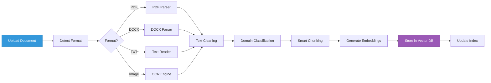

### Conversation Memory Pipeline

```mermaid
graph TB
    subgraph "Memory Pipeline"
        New[New Message] --> Buffer[Add to Buffer]
        Buffer --> Check{Buffer Full?}
        Check -->|No| Continue[Continue Conversation]
        Check -->|Yes| Summarize[Summarize Buffer]
        Summarize --> Store[Store Summary]
        Store --> Clear[Clear Buffer]
        Clear --> Continue
        
        Continue --> Retrieve[Retrieve Context]
        Retrieve --> Recent[Recent Messages]
        Retrieve --> Summaries[Past Summaries]
        Retrieve --> Entities[Key Entities]
        
        Recent & Summaries & Entities --> Context[Build Context]
    end

    style New fill:#3498DB,stroke:#2E86C1,color:#fff
    style Context fill:#27AE60,stroke:#1E8449,color:#fff
```

### Embedding Pipeline

```mermaid
graph LR
    subgraph "Batch Embedding Pipeline"
        Source[Source Documents]
        Queue[Processing Queue]
        Batch[Batch Processor]
        Embed[Embedding Model]
        VDB[(Vector DB)]
        Log[Processing Log]
    end

    Source --> Queue --> Batch --> Embed --> VDB
    Batch --> Log

    style Source fill:#3498DB,stroke:#2E86C1,color:#fff
    style VDB fill:#9B59B6,stroke:#7D3C98,color:#fff
```

---

## 📊 State Diagrams

### Conversation State

```mermaid
stateDiagram-v2
    [*] --> Idle
    Idle --> Processing: User sends query
    Processing --> Classifying: Query received
    Classifying --> Routing: Intent identified
    Routing --> Retrieving: Agent selected
    Retrieving --> Generating: Knowledge retrieved
    Generating --> Validating: Response generated
    Validating --> Responding: Validation passed
    Validating --> Generating: Validation failed (retry)
    Responding --> Idle: Response delivered
    
    Idle --> Archived: User archives
    Idle --> Deleted: User deletes
    Archived --> [*]
    Deleted --> [*]
    
    Processing --> Error: System error
    Error --> Idle: Error handled
```

### Agent Lifecycle State

```mermaid
stateDiagram-v2
    [*] --> Registered
    Registered --> Initializing: System startup
    Initializing --> Ready: KB loaded, model connected
    Initializing --> Error: Init failure
    
    Ready --> Processing: Query assigned
    Processing --> Ready: Query completed
    Processing --> Error: Processing failure
    
    Ready --> Maintenance: Admin disables
    Maintenance --> Ready: Admin enables
    
    Error --> Initializing: Retry
    Error --> Disabled: Max retries exceeded
    Disabled --> [*]
```

### Query Processing State

```mermaid
stateDiagram-v2
    [*] --> Received
    Received --> Authenticated: JWT valid
    Received --> Rejected: JWT invalid
    Rejected --> [*]
    
    Authenticated --> Classified: Intent detected
    Classified --> Routed: Agent selected
    
    Routed --> SingleAgent: Single domain
    Routed --> MultiAgent: Multi-domain
    
    SingleAgent --> KnowledgeRetrieved: RAG complete
    MultiAgent --> KnowledgeRetrieved: Parallel RAG complete
    
    KnowledgeRetrieved --> Generated: LLM response ready
    Generated --> Validated: Confidence >= threshold
    Generated --> LowConfidence: Confidence < threshold
    
    LowConfidence --> DisclaimerAdded: Add warnings
    DisclaimerAdded --> Stored
    Validated --> Stored: Save to DB
    Stored --> Delivered: Response sent
    Delivered --> [*]
```

---

> [!TIP]
> Continue to [Development & Implementation](04_Development_and_Implementation.md) for coding standards, API implementation, and CI/CD pipeline.

---

<div align="center">

**MediOrchestrator AI** — *AI & Agent Architecture*

</div>
