<div align="center">

# 🔒 Deployment, Security & Research

## MediOrchestrator AI

**Deployment Strategy, Security Implementation, Monitoring, and Research Roadmap**

</div>

---

## Table of Contents

- [Deployment Architecture](#-deployment-architecture)
- [Security Architecture](#-security-architecture)
- [JWT Implementation](#-jwt-implementation)
- [OAuth 2.0](#-oauth-20)
- [OWASP Compliance](#-owasp-compliance)
- [Trivy Security Scanning](#-trivy-security-scanning)
- [SBOM Generation](#-sbom-generation)
- [MLflow Integration](#-mlflow-integration)
- [LangFuse Observability](#-langfuse-observability)
- [Monitoring & Logging](#-monitoring--logging)
- [Research Opportunities](#-research-opportunities)
- [Future Enhancements](#-future-enhancements)
- [References](#-references)
- [Glossary](#-glossary)

---

## 🚀 Deployment Architecture

### Deployment Overview

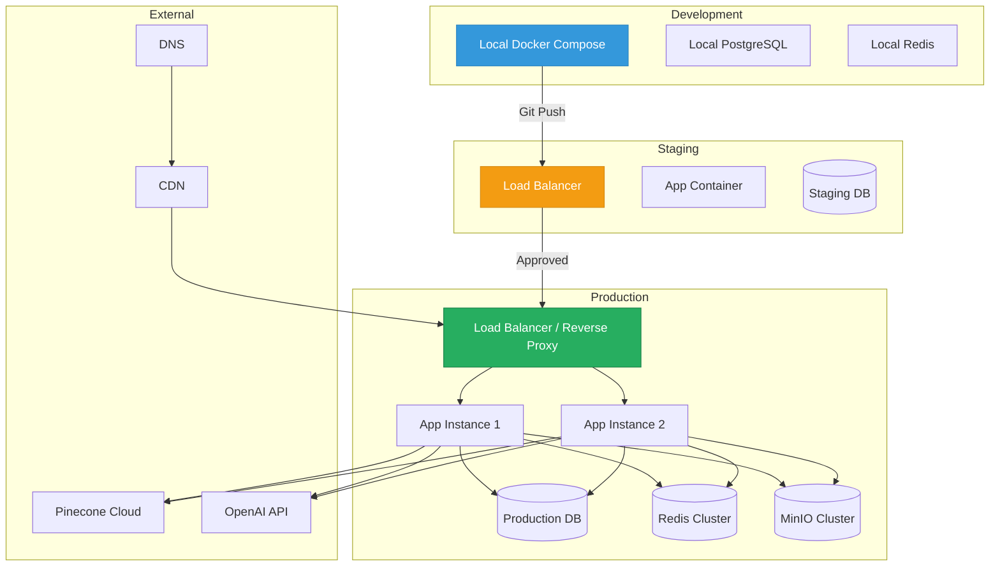

### Deployment Environments

| Environment | Purpose | Infrastructure | URL |
|---|---|---|---|
| **Development** | Local development | Docker Compose | `localhost:3000/8000` |
| **Staging** | Pre-production testing | Single instance | `staging.mediorch.dev` |
| **Production** | Live deployment | Multi-instance | `app.mediorch.dev` |

### Docker Compose Deployment

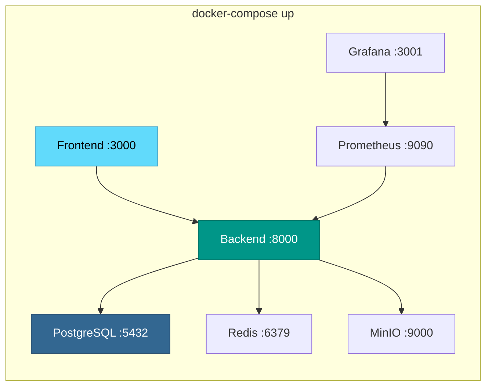

### Deployment Checklist

| # | Task | Category |
|---|---|---|
| 1 | Set all environment variables | Configuration |
| 2 | Run database migrations | Database |
| 3 | Load knowledge bases | AI |
| 4 | Generate vector embeddings | AI |
| 5 | Configure SSL/TLS certificates | Security |
| 6 | Set up reverse proxy (Nginx) | Infrastructure |
| 7 | Configure monitoring dashboards | Observability |
| 8 | Run security scans | Security |
| 9 | Verify health endpoints | Operations |
| 10 | Run smoke tests | Testing |

### Nginx Configuration

```nginx
# infrastructure/nginx/nginx.conf
upstream backend {
    server backend:8000;
}

server {
    listen 80;
    server_name app.mediorch.dev;
    return 301 https://$host$request_uri;
}

server {
    listen 443 ssl http2;
    server_name app.mediorch.dev;

    ssl_certificate     /etc/nginx/ssl/cert.pem;
    ssl_certificate_key /etc/nginx/ssl/key.pem;

    # Frontend
    location / {
        root /usr/share/nginx/html;
        try_files $uri $uri/ /index.html;
    }

    # Backend API
    location /api/ {
        proxy_pass http://backend;
        proxy_set_header Host $host;
        proxy_set_header X-Real-IP $remote_addr;
        proxy_set_header X-Forwarded-For $proxy_add_x_forwarded_for;
        proxy_set_header X-Forwarded-Proto $scheme;
    }

    # SSE Streaming
    location /api/v1/query/stream {
        proxy_pass http://backend;
        proxy_set_header Connection '';
        proxy_http_version 1.1;
        chunked_transfer_encoding off;
        proxy_buffering off;
        proxy_cache off;
    }

    # Health check
    location /health {
        proxy_pass http://backend/api/v1/health;
    }
}
```

---

## 🛡 Security Architecture

### Security Layers

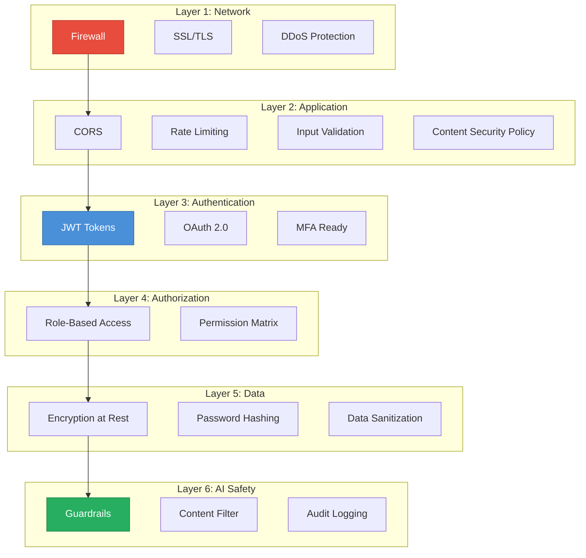

### Security Measures Summary

| Layer | Measure | Implementation |
|---|---|---|
| **Network** | SSL/TLS encryption | Let's Encrypt + Nginx |
| **Network** | Rate limiting | FastAPI middleware (100 req/min) |
| **Network** | CORS restrictions | Whitelist allowed origins |
| **Auth** | JWT access tokens | python-jose, 1-hour expiry |
| **Auth** | Refresh tokens | HttpOnly cookies, 7-day expiry |
| **Auth** | Password hashing | bcrypt (12 rounds) |
| **Data** | Input validation | Pydantic strict mode |
| **Data** | SQL injection prevention | SQLAlchemy ORM (parameterized) |
| **Data** | XSS prevention | Content Security Policy headers |
| **AI** | Prompt injection defense | Input sanitization + guardrails |
| **AI** | Content filtering | Output safety checks |
| **Infra** | Container scanning | Trivy (every CI run) |
| **Infra** | Dependency scanning | SBOM + vulnerability checks |
| **Audit** | Request logging | Structured logging with request IDs |

---

## 🔑 JWT Implementation

### JWT Flow

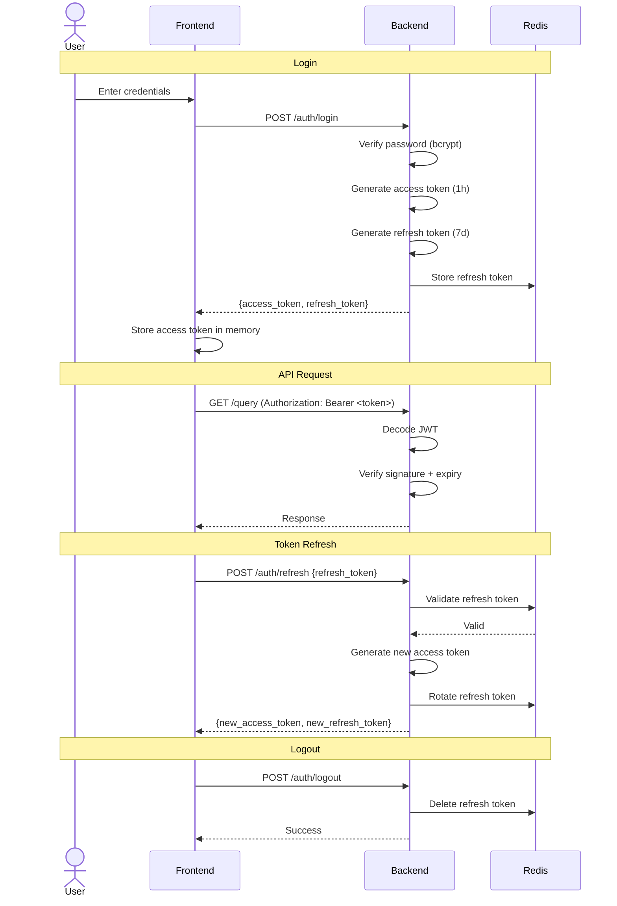

### JWT Token Structure

| Field | Access Token | Refresh Token |
|---|---|---|
| `sub` | User UUID | User UUID |
| `email` | User email | — |
| `role` | User role | — |
| `type` | "access" | "refresh" |
| `iat` | Issue timestamp | Issue timestamp |
| `exp` | +1 hour | +7 days |
| **Signing Key** | `JWT_SECRET` | `JWT_REFRESH_SECRET` |
| **Algorithm** | HS256 | HS256 |
| **Storage** | In-memory (frontend) | HttpOnly cookie + Redis |

### Security Configuration

| Setting | Value | Rationale |
|---|---|---|
| Algorithm | HS256 | Symmetric, fast, sufficient for single-service |
| Access expiry | 1 hour | Limits exposure window |
| Refresh expiry | 7 days | User convenience vs security |
| bcrypt rounds | 12 | Balance of security and speed |
| Minimum password | 8 chars + complexity | NIST recommendation |
| Token rotation | On every refresh | Prevents token reuse |

---

## 🌐 OAuth 2.0

### OAuth 2.0 Flow (Google)

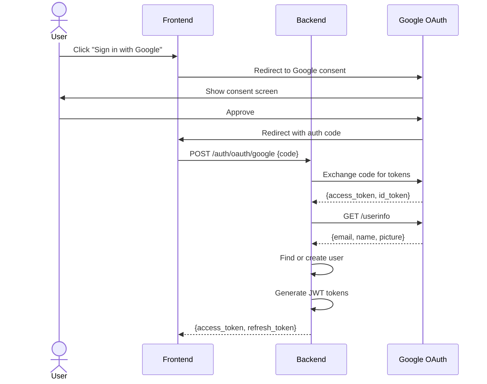

### OAuth Provider Support

| Provider | Status | Scopes |
|---|---|---|
| Google | ✅ Planned | `openid`, `email`, `profile` |
| GitHub | 🔮 Future | `user:email` |
| Microsoft | 🔮 Future | `openid`, `email`, `profile` |

---

## 🔐 OWASP Compliance

### OWASP Top 10 Coverage

| # | Risk | Status | Mitigation |
|---|---|---|---|
| A01 | **Broken Access Control** | ✅ | RBAC, JWT validation, route guards |
| A02 | **Cryptographic Failures** | ✅ | SSL/TLS, bcrypt, secure token generation |
| A03 | **Injection** | ✅ | Pydantic validation, SQLAlchemy ORM, parameterized queries |
| A04 | **Insecure Design** | ✅ | Threat modeling, security-by-design architecture |
| A05 | **Security Misconfiguration** | ✅ | Environment-based config, no defaults in production |
| A06 | **Vulnerable Components** | ✅ | Trivy scanning, SBOM tracking, automated updates |
| A07 | **Authentication Failures** | ✅ | JWT + refresh rotation, rate limiting on auth endpoints |
| A08 | **Data Integrity Failures** | ✅ | Input validation, CI/CD integrity checks |
| A09 | **Logging & Monitoring** | ✅ | Structured logging, Prometheus metrics, alert rules |
| A10 | **Server-Side Request Forgery** | ✅ | URL allowlisting, network segmentation |

### Security Headers

```python
# Middleware configuration
SECURITY_HEADERS = {
    "X-Content-Type-Options": "nosniff",
    "X-Frame-Options": "DENY",
    "X-XSS-Protection": "1; mode=block",
    "Strict-Transport-Security": "max-age=31536000; includeSubDomains",
    "Content-Security-Policy": "default-src 'self'; script-src 'self'",
    "Referrer-Policy": "strict-origin-when-cross-origin",
    "Permissions-Policy": "camera=(), microphone=(), geolocation=()",
}
```

---

## 🔍 Trivy Security Scanning

### Trivy Integration

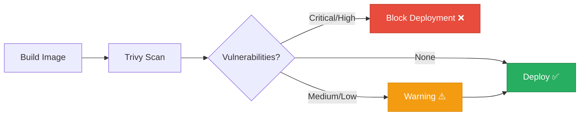

### Trivy Scan Types

| Scan Type | Target | Frequency | Action |
|---|---|---|---|
| **Container** | Docker images | Every CI build | Block on critical |
| **Filesystem** | Source code | Every PR | Report findings |
| **Repository** | Git repo | Weekly | Security review |
| **Config** | IaC files | Every change | Flag misconfigs |

### Trivy Commands

```bash
# Scan Docker image
trivy image mediorch-backend:latest

# Scan filesystem
trivy fs ./backend

# Scan with severity filter
trivy image --severity HIGH,CRITICAL mediorch-backend:latest

# Generate SARIF report
trivy image --format sarif --output trivy.sarif mediorch-backend:latest

# Scan Dockerfile for misconfigurations
trivy config ./backend/Dockerfile
```

### GitHub Actions Integration

```yaml
# .github/workflows/security.yml
name: Security Scan

on:
  push:
    branches: [main]
  schedule:
    - cron: '0 6 * * 1'  # Weekly Monday 6 AM

jobs:
  trivy-scan:
    runs-on: ubuntu-latest
    steps:
      - uses: actions/checkout@v4

      - name: Build image
        run: docker build -t mediorch-backend ./backend

      - name: Trivy vulnerability scan
        uses: aquasecurity/trivy-action@master
        with:
          image-ref: mediorch-backend
          format: table
          exit-code: 1
          severity: CRITICAL,HIGH

      - name: Trivy config scan
        uses: aquasecurity/trivy-action@master
        with:
          scan-type: config
          scan-ref: .
          format: table
```

---

## 📋 SBOM Generation

### What is SBOM?

**Software Bill of Materials** — a complete inventory of all software components, libraries, and dependencies used in the project.

### SBOM Generation Pipeline

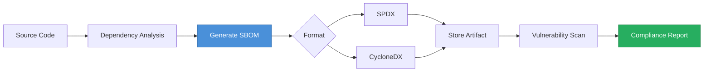

### SBOM Generation Commands

```bash
# Generate SBOM with Trivy (CycloneDX format)
trivy image --format cyclonedx --output sbom.json mediorch-backend:latest

# Generate SBOM with syft
syft mediorch-backend:latest -o cyclonedx-json > sbom.json

# Scan SBOM for vulnerabilities
trivy sbom sbom.json
```

### SBOM Contents

| Category | Examples |
|---|---|
| **Python Packages** | fastapi, langchain, sqlalchemy, pydantic |
| **System Libraries** | libc, openssl, libpq |
| **Container Base** | python:3.11-slim (Debian bookworm) |
| **Node Packages** | react, react-dom, zustand, axios |
| **Build Tools** | vite, typescript, tailwindcss |

---

## 📊 MLflow Integration

### MLflow in MediOrchestrator

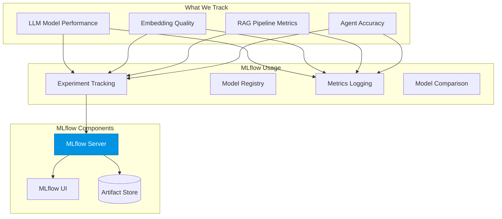

### MLflow Experiment Tracking

| Experiment | Metrics Tracked | Parameters |
|---|---|---|
| **LLM Comparison** | Latency, cost, quality score | Model name, temperature, max_tokens |
| **Embedding Models** | Retrieval precision, recall | Model, dimensions, chunk_size |
| **RAG Pipeline** | Faithfulness, relevance, groundedness | top_k, similarity_threshold |
| **Agent Routing** | Classification accuracy, F1 | Classifier model, threshold |
| **Prompt Engineering** | Response quality, hallucination rate | Prompt version, few-shot count |

### MLflow Code Integration

```python
import mlflow

# Track RAG experiment
with mlflow.start_run(experiment_id="rag_optimization"):
    mlflow.log_params({
        "embedding_model": "text-embedding-3-small",
        "chunk_size": 1000,
        "overlap": 200,
        "top_k": 5,
        "llm_model": "gpt-4",
    })
    
    mlflow.log_metrics({
        "faithfulness": 0.94,
        "answer_relevance": 0.88,
        "context_precision": 0.82,
        "context_recall": 0.87,
        "latency_ms": 2340,
        "cost_per_query": 0.035,
    })
```

---

## 🔭 LangFuse Observability

### LangFuse Architecture

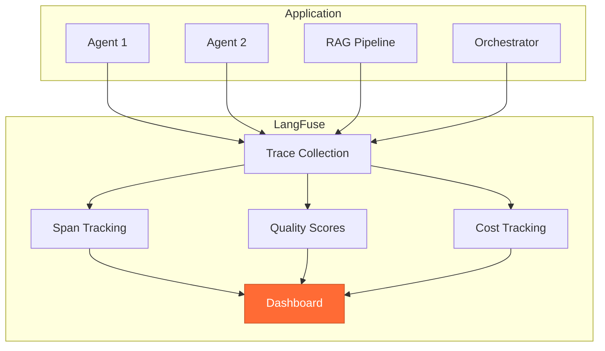

### What LangFuse Tracks

| Metric | Description | Value |
|---|---|---|
| **Traces** | Complete query execution paths | Debug & optimize |
| **Spans** | Individual step timings | Identify bottlenecks |
| **Generations** | LLM call details | Cost & quality |
| **Scores** | Quality evaluations | Track improvements |
| **Cost** | Per-query token costs | Budget management |
| **Latency** | End-to-end response time | Performance monitoring |

### LangFuse Code Integration

```python
from langfuse import Langfuse
from langfuse.decorators import observe

langfuse = Langfuse()

@observe()
async def process_query(query: str, user_id: str):
    """Traced query processing."""
    
    # This creates a trace automatically
    intent = await classify_intent(query)
    agent = await select_agent(intent.domain)
    response = await agent.process(query)
    
    # Log quality score
    langfuse.score(
        name="response_quality",
        value=response.confidence,
        comment=f"Agent: {agent.name}, Domain: {intent.domain}",
    )
    
    return response

@observe()
async def classify_intent(query: str):
    """Traced intent classification."""
    # LangFuse tracks this as a span within the parent trace
    ...

@observe(as_type="generation")
async def generate_response(prompt: str, model: str):
    """Traced LLM generation."""
    # LangFuse tracks tokens, cost, latency automatically
    ...
```

### LangFuse Dashboard Views

| View | Shows | Used For |
|---|---|---|
| **Traces** | Full query execution | Debugging issues |
| **Generations** | LLM calls detail | Cost optimization |
| **Scores** | Quality over time | Track improvements |
| **Latency** | Response time trends | Performance monitoring |
| **Users** | Per-user analytics | Usage patterns |
| **Cost** | Token cost breakdown | Budget planning |

---

## 📈 Monitoring & Logging

### Monitoring Stack

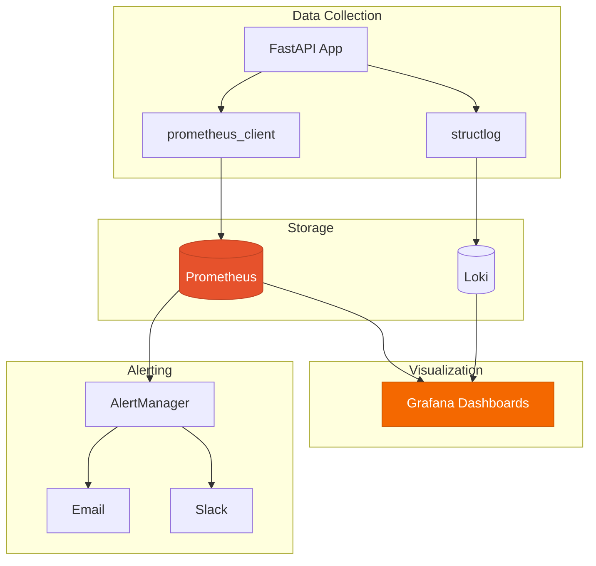

### Key Metrics

| Category | Metric | Alert Threshold |
|---|---|---|
| **API** | `http_requests_total` | — |
| **API** | `http_request_duration_seconds` | p99 > 2s |
| **API** | `http_requests_errors_total` | Rate > 5% |
| **AI** | `agent_response_time_seconds` | p99 > 5s |
| **AI** | `intent_classification_accuracy` | < 85% |
| **AI** | `rag_retrieval_latency_seconds` | p99 > 1s |
| **AI** | `llm_token_cost_total` | Daily > budget |
| **DB** | `db_query_duration_seconds` | p99 > 500ms |
| **DB** | `db_connection_pool_usage` | > 80% |
| **Cache** | `redis_hit_rate` | < 70% |
| **System** | `cpu_usage_percent` | > 80% |
| **System** | `memory_usage_percent` | > 85% |

### Prometheus Metrics Implementation

```python
from prometheus_client import Counter, Histogram, Gauge
from prometheus_fastapi_instrumentator import Instrumentator

# Custom metrics
QUERY_COUNT = Counter(
    "mediorch_queries_total",
    "Total queries processed",
    ["agent", "domain", "status"]
)

QUERY_LATENCY = Histogram(
    "mediorch_query_duration_seconds",
    "Query processing time",
    ["agent"],
    buckets=[0.1, 0.5, 1, 2, 3, 5, 10]
)

ACTIVE_AGENTS = Gauge(
    "mediorch_active_agents",
    "Number of active agents"
)

LLM_TOKENS = Counter(
    "mediorch_llm_tokens_total",
    "Total LLM tokens used",
    ["model", "type"]  # type: input/output
)

# Auto-instrument FastAPI
Instrumentator().instrument(app).expose(app)
```

### Structured Logging

```python
import structlog

logger = structlog.get_logger()

# Structured log example
logger.info(
    "query_processed",
    user_id="uuid-123",
    query_id="query-456",
    agent="cardiology_agent",
    domain="cardiology",
    confidence=0.92,
    latency_ms=2340,
    tokens_used=847,
    model="gpt-4",
    sources_count=3,
)
```

### Log Format

```json
{
  "timestamp": "2024-01-15T10:30:00Z",
  "level": "info",
  "event": "query_processed",
  "request_id": "req-abc123",
  "user_id": "uuid-123",
  "agent": "cardiology_agent",
  "domain": "cardiology",
  "confidence": 0.92,
  "latency_ms": 2340,
  "tokens_used": 847,
  "model": "gpt-4"
}
```

### Grafana Dashboard Panels

| Panel | Type | Data Source | Shows |
|---|---|---|---|
| Request Rate | Time series | Prometheus | Requests per second |
| Error Rate | Time series | Prometheus | Error percentage |
| Response Latency | Heatmap | Prometheus | Latency distribution |
| Agent Usage | Pie chart | Prometheus | Queries per agent |
| LLM Cost | Bar chart | Prometheus | Cost per model |
| Active Users | Gauge | Prometheus | Current users |
| System Health | Status grid | Prometheus | Service status |

---

## 🔬 Research Opportunities

### Research Areas Map

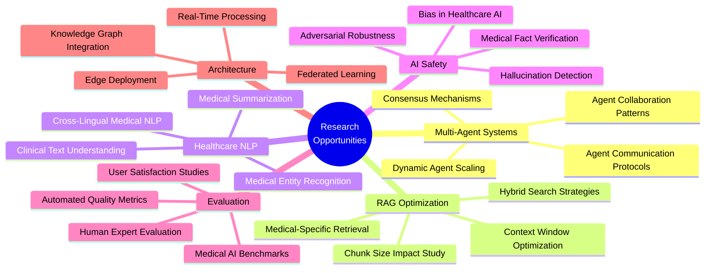

### Research Paper Opportunities

| # | Title | Area | Novelty |
|---|---|---|---|
| 1 | Multi-Agent Orchestration for Healthcare Information Delivery | AI Architecture | Novel agent routing approach |
| 2 | RAG vs. Fine-Tuning for Medical Domain Accuracy | RAG | Comparative study |
| 3 | Hallucination Detection in Medical AI Responses | AI Safety | Domain-specific detection |
| 4 | Embedding Model Comparison for Medical Literature | Embeddings | Medical benchmark |
| 5 | Cross-Domain Agent Collaboration in Healthcare Queries | Multi-Agent | Novel collaboration patterns |
| 6 | Conversation Memory Strategies for Health Consultations | Memory | Optimized memory architecture |
| 7 | Confidence Scoring for Medical AI Responses | Evaluation | Scoring framework |
| 8 | Prompt Engineering for Medical Domain Accuracy | Prompting | Medical prompt strategies |

### Research Methodology


### Suggested Venues

| Venue | Type | Focus |
|---|---|---|
| ACL / EMNLP | Conference | NLP & Computational Linguistics |
| AAAI | Conference | Artificial Intelligence |
| AMIA | Conference | Health Informatics |
| NeurIPS (Workshop) | Workshop | ML for Health |
| JMIR | Journal | Medical Internet Research |
| IEEE JBHI | Journal | Biomedical & Health Informatics |

---

## 🔮 Future Enhancements

### Enhancement Roadmap

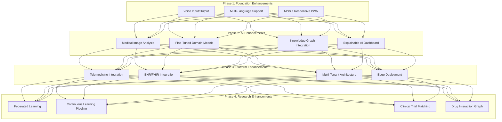

### Enhancement Details

| Enhancement | Impact | Complexity | Priority |
|---|---|---|---|
| Voice input/output | High UX improvement | Medium | High |
| Multi-language support | Broader reach | Medium | High |
| Medical image analysis | New capability | High | Medium |
| Fine-tuned models | Better accuracy | High | Medium |
| Knowledge graphs | Better reasoning | High | Medium |
| EHR/FHIR integration | Clinical value | Very High | Low (regulatory) |
| Federated learning | Privacy-preserving AI | Very High | Low (research) |
| Edge deployment | Low-latency, offline | High | Low |

---

## 📖 References

### Core Technologies

| Technology | Documentation |
|---|---|
| LangChain | https://python.langchain.com/docs/ |
| LangGraph | https://langchain-ai.github.io/langgraph/ |
| LangFuse | https://langfuse.com/docs |
| FastAPI | https://fastapi.tiangolo.com |
| React | https://react.dev |
| PostgreSQL | https://www.postgresql.org/docs/ |
| Redis | https://redis.io/docs/ |
| Pinecone | https://docs.pinecone.io |
| Docker | https://docs.docker.com |
| MLflow | https://mlflow.org/docs/latest/ |
| Trivy | https://aquasecurity.github.io/trivy/ |

### AI & Research

| Resource | Link |
|---|---|
| OpenAI API | https://platform.openai.com/docs/ |
| Google Gemini API | https://ai.google.dev/docs |
| RAGAS (RAG Evaluation) | https://docs.ragas.io |
| LlamaIndex | https://docs.llamaindex.ai |
| Hugging Face | https://huggingface.co/docs |

### Security

| Standard | Reference |
|---|---|
| OWASP Top 10 | https://owasp.org/Top10/ |
| JWT RFC 7519 | https://datatracker.ietf.org/doc/html/rfc7519 |
| OAuth 2.0 RFC 6749 | https://datatracker.ietf.org/doc/html/rfc6749 |
| SBOM (NTIA) | https://www.ntia.gov/SBOM |
| CycloneDX | https://cyclonedx.org |

### Medical Data Sources

| Source | Type |
|---|---|
| PubMed | Research papers |
| MedlinePlus | Patient information |
| WHO | Global health guidelines |
| CDC | Disease control resources |
| FDA | Drug information |
| DrugBank | Drug database |

---

## 📝 Glossary

| Term | Definition |
|---|---|
| **Agentic AI** | AI systems that can make decisions, take actions, and collaborate autonomously |
| **RAG** | Retrieval-Augmented Generation — grounding LLM responses in retrieved knowledge |
| **LLM** | Large Language Model — AI models trained on massive text data |
| **Vector Database** | Database optimized for storing and searching high-dimensional vectors |
| **Embedding** | Dense numerical representation of text in vector space |
| **Orchestrator** | Central component that manages query routing and agent coordination |
| **Intent Classification** | Determining the purpose/domain of a user query |
| **Knowledge Base** | Curated collection of domain-specific information |
| **Chunking** | Splitting documents into smaller pieces for embedding |
| **Hallucination** | When an LLM generates plausible but incorrect information |
| **Guardrails** | Safety mechanisms to prevent harmful AI outputs |
| **Confidence Score** | Numerical measure of AI certainty in its response |
| **RBAC** | Role-Based Access Control — permissions based on user roles |
| **JWT** | JSON Web Token — compact, URL-safe token for authentication |
| **OAuth 2.0** | Open standard for authorization delegation |
| **SBOM** | Software Bill of Materials — inventory of software components |
| **CORS** | Cross-Origin Resource Sharing — browser security mechanism |
| **SSE** | Server-Sent Events — protocol for streaming data to clients |
| **ORM** | Object-Relational Mapping — database abstraction layer |
| **CI/CD** | Continuous Integration / Continuous Deployment |
| **OWASP** | Open Web Application Security Project |
| **NLI** | Natural Language Inference — checking textual entailment |
| **SPDX** | Software Package Data Exchange — SBOM standard |
| **ASGI** | Asynchronous Server Gateway Interface — Python web server protocol |
| **Pydantic** | Python library for data validation using type hints |
| **Prometheus** | Open-source monitoring and alerting toolkit |
| **Grafana** | Visualization and analytics platform |
| **MinIO** | S3-compatible object storage |
| **Pinecone** | Managed vector database service |
| **LangFuse** | LLM observability and analytics platform |
| **MLflow** | ML experiment tracking and model management |
| **Trivy** | Container and dependency vulnerability scanner |

---

> [!NOTE]
> This documentation is a living document. It will be updated as the project evolves, new features are added, and research progresses.

---

<div align="center">

**MediOrchestrator AI** — *Deployment, Security & Research*

---

*Documentation generated for the MediOrchestrator AI project*
*Agentic Multi-LLM Healthcare Intelligence Platform*

</div>
