# MediOrchestrator

> An intelligent healthcare AI orchestration system that understands a health query, routes it to the right medical domain, retrieves relevant knowledge, and generates a safer response.

---

## Project Overview

MediOrchestrator is not just a single healthcare chatbot.

The main idea is to have one central orchestration system that decides how a query should be handled.

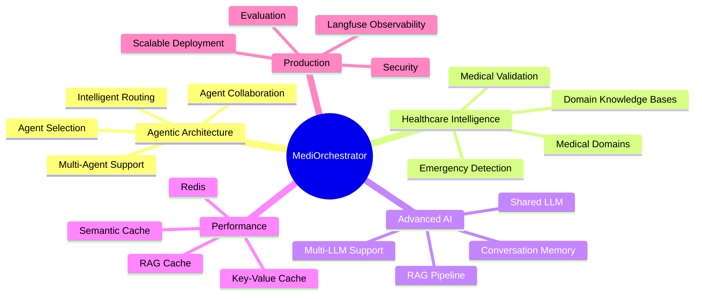

---

# Architecture

The overall system is built around an AI Orchestrator.

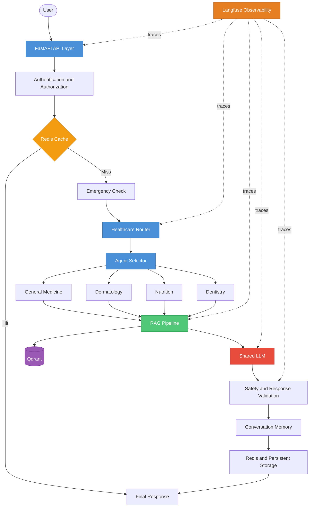

---

# Core Components

| Component | Purpose |
|---|---|
| API Layer | Receives requests and returns responses |
| Emergency Check | Detects potentially urgent situations |
| Router | Identifies the medical domain |
| Agent Selector | Chooses which agent or agents should handle the query |
| Agents | Apply domain-specific instructions and tools |
| RAG | Retrieves relevant medical knowledge |
| Shared LLM | Reasons over the query and context |
| Safety Layer | Validates the final response |
| Redis | Handles caching and temporary state |
| Qdrant | Stores and searches knowledge embeddings |
| PostgreSQL | Stores persistent application data |
| LangGraph | Controls the AI workflow |
| Langfuse | Traces and monitors the system |

---

# 1. Routing and Agent Selection

## Router

The Router answers:

> What medical domain is this query related to?

For example:

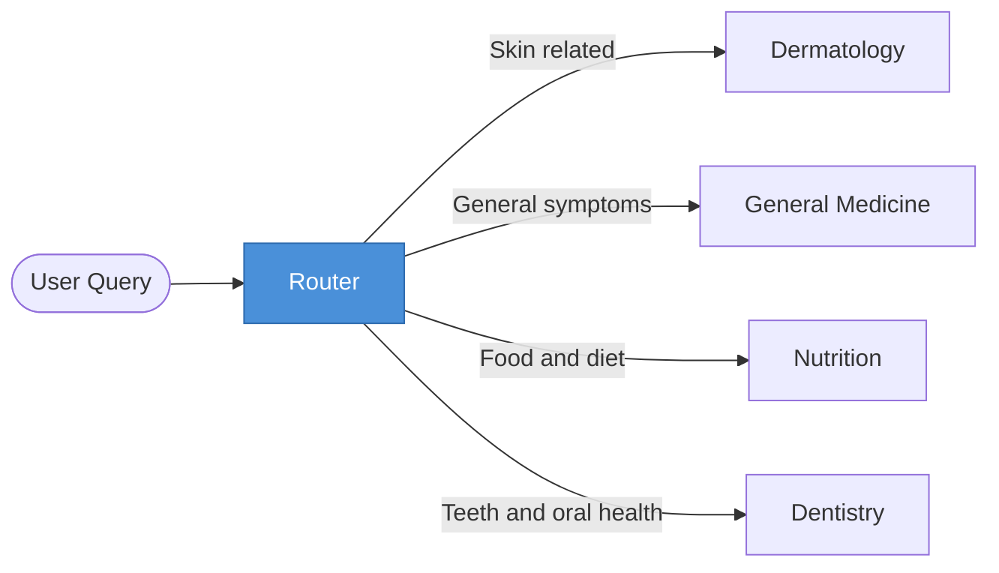

The router can use a hybrid approach.

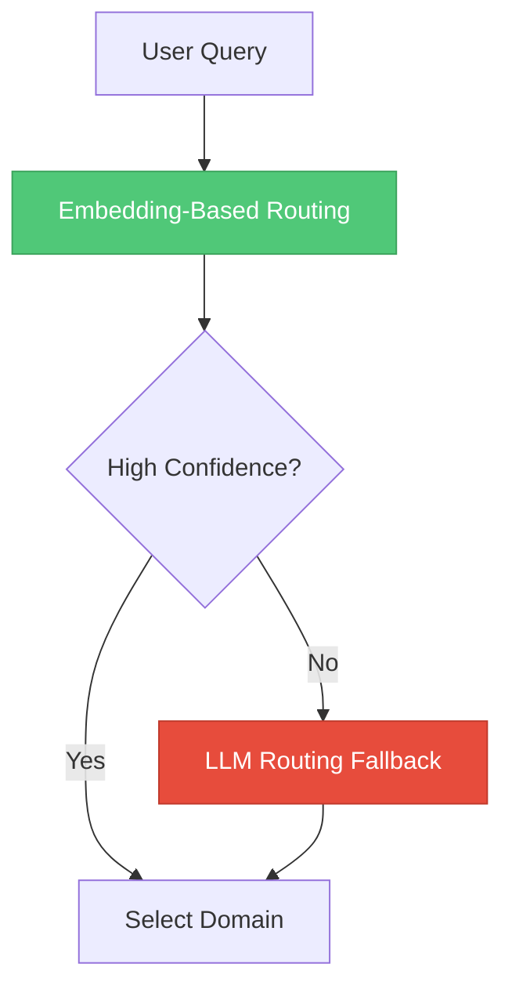

| Method | Purpose |
|---|---|
| Embedding similarity | Fast domain matching |
| Confidence threshold | Checks whether the result is reliable |
| LLM fallback | Handles unclear or multi-domain queries |

---

## Agent Selector

The Agent Selector answers:

> Which agent or agents should handle this query?

The Router identifies the domain. The Agent Selector decides the actual workflow.

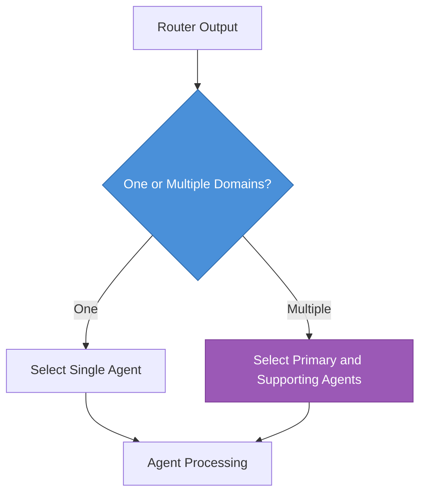

| Router | Agent Selector |
|---|---|
| What is the query about? | Who should handle it? |
| Identifies domains | Selects the agent workflow |
| Can return multiple domains | Can select multiple agents |

---

# 2. Specialized Agents

Each agent is not necessarily a separate LLM.

The system can use one shared LLM. The agents provide specialization through instructions, knowledge, tools, and rules.

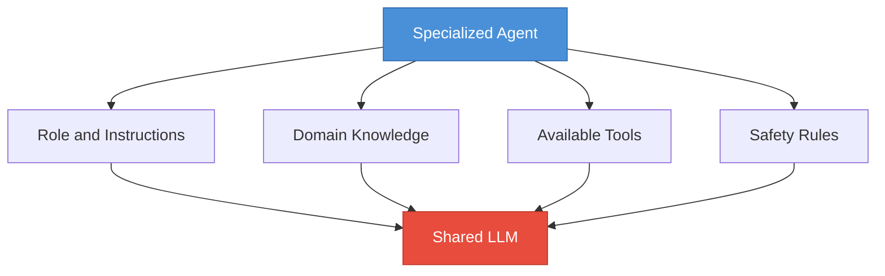

## Initial Agents

| Agent | Main Focus |
|---|---|
| General Medicine | General health and common symptoms |
| Dermatology | Skin, hair, and nail queries |
| Nutrition | Diet and nutrition |
| Dentistry | Teeth and oral health |

Additional domains can be added later.

---

# 3. RAG Pipeline

RAG retrieves relevant medical information before the LLM generates a response.

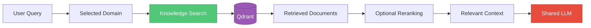

## RAG Improvements

| Technique | Purpose |
|---|---|
| Query rewriting | Improves unclear search queries |
| Hybrid search | Combines semantic and keyword search |
| Reranking | Selects the most relevant documents |
| Metadata filtering | Keeps retrieval inside the correct medical domain |

---

# 4. Redis and Caching

Redis is mainly used to avoid doing the same work repeatedly and to store fast temporary data.

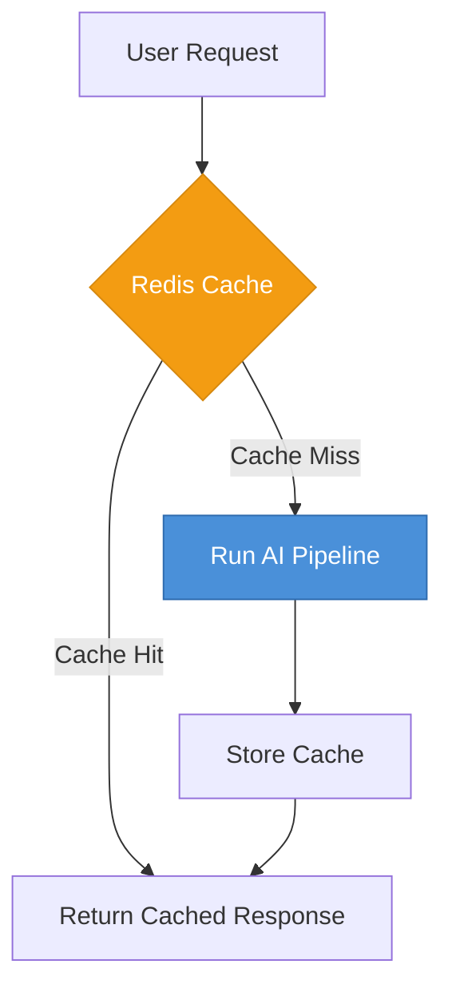

## Caching Techniques

### Key-Value Cache

Used when the same request is repeated.

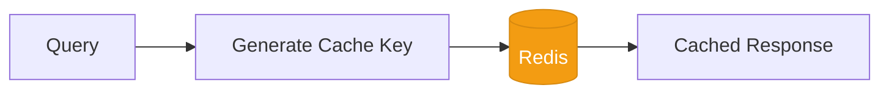

### Semantic Cache

Used when two queries are different in wording but similar in meaning.

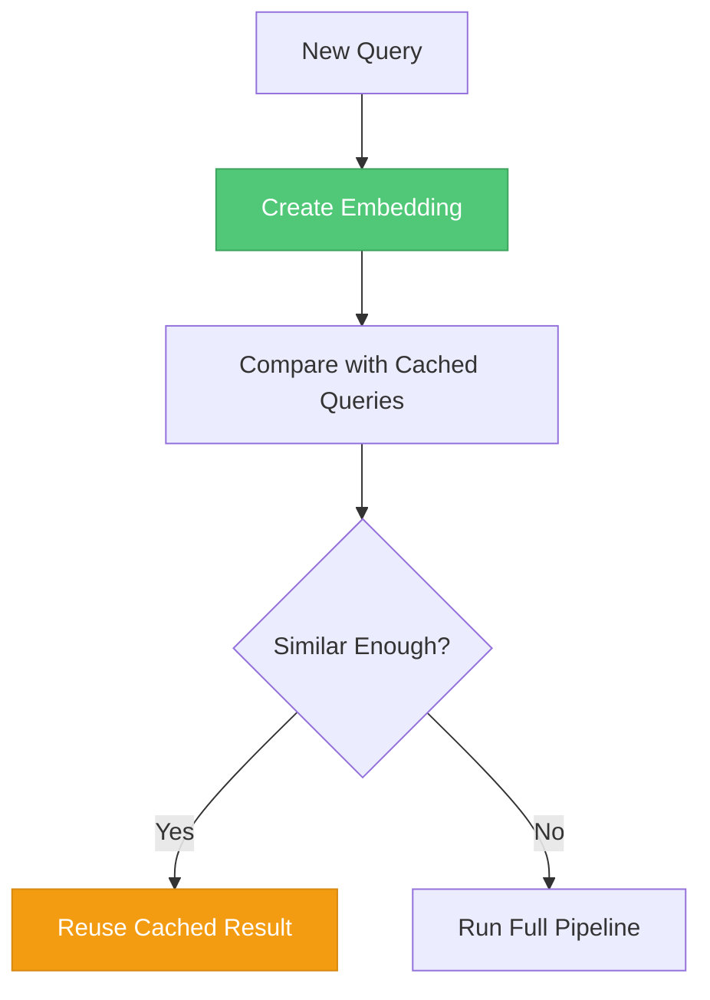

### RAG Cache

Used to reuse retrieval results for repeated or similar searches.

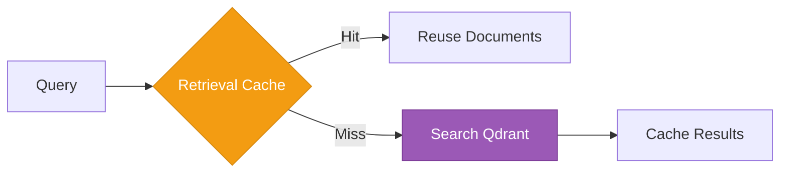

## Redis Responsibilities

| Use Case | Purpose |
|---|---|
| Response Cache | Avoid repeated full processing |
| Semantic Cache | Reuse results for similar queries |
| RAG Cache | Reuse retrieved documents |
| Session State | Store temporary conversation context |
| Rate Limiting | Control excessive requests |

---

# 5. Conversation Memory

Conversation memory helps the system retain useful context during a session.

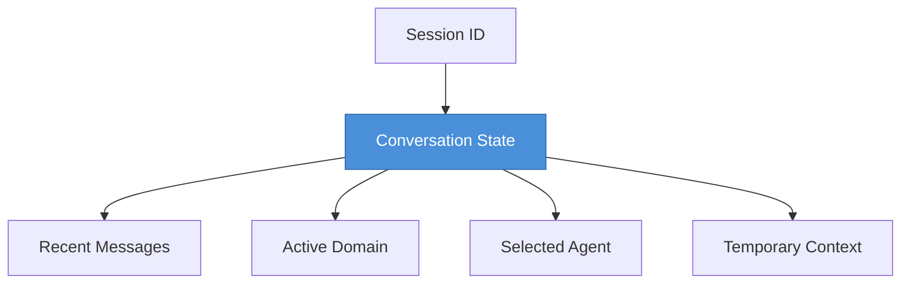

| Redis | PostgreSQL |
|---|---|
| Fast temporary data | Persistent data |
| Session state | User and application data |
| Cache | Long-term records |
| Short-lived context | Permanent storage |

---

# 6. LangGraph Workflow

LangGraph manages the conditional flow between different parts of the system.

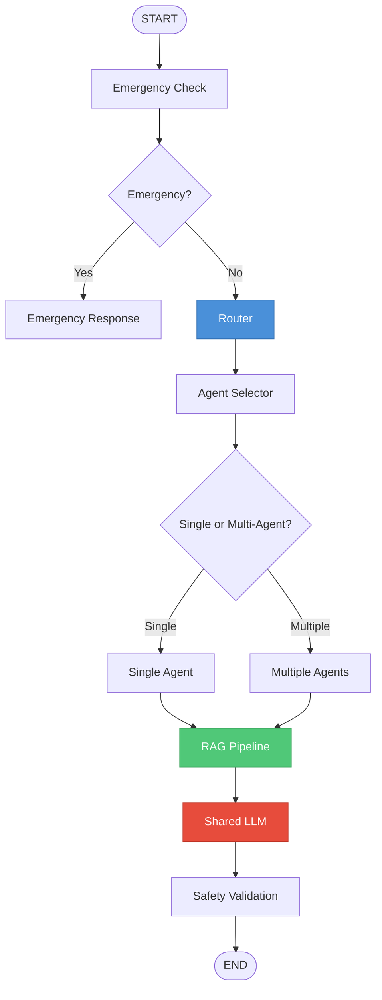

---

# 7. Langfuse Observability

Langfuse allows us to see what happens inside the AI system.

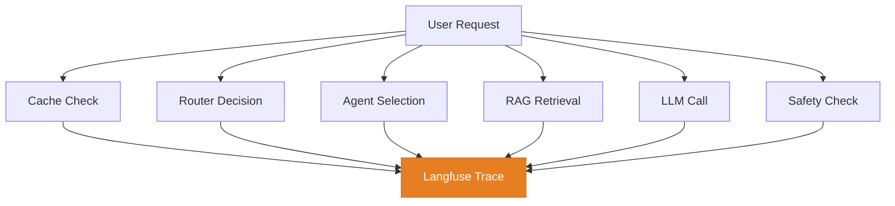

## What Langfuse Helps Track

| What | Why |
|---|---|
| Routing decisions | Check domain selection |
| Agent selection | Understand the chosen workflow |
| RAG retrieval | Evaluate retrieved information |
| LLM calls | Inspect prompts and responses |
| Latency | Find slow components |
| Cache hits and misses | Measure cache effectiveness |
| Errors | Debug failures |

Langfuse observes the system. It does not perform the routing or generation.

---

# 8. Safety Architecture

Safety checks should happen before and after the AI workflow.

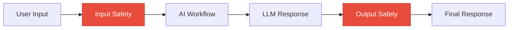

| Stage | Purpose |
|---|---|
| Input Safety | Emergency detection and input validation |
| Agent Rules | Domain-specific boundaries |
| Output Safety | Check potentially unsafe or unsupported responses |

---

# 9. Application Architecture

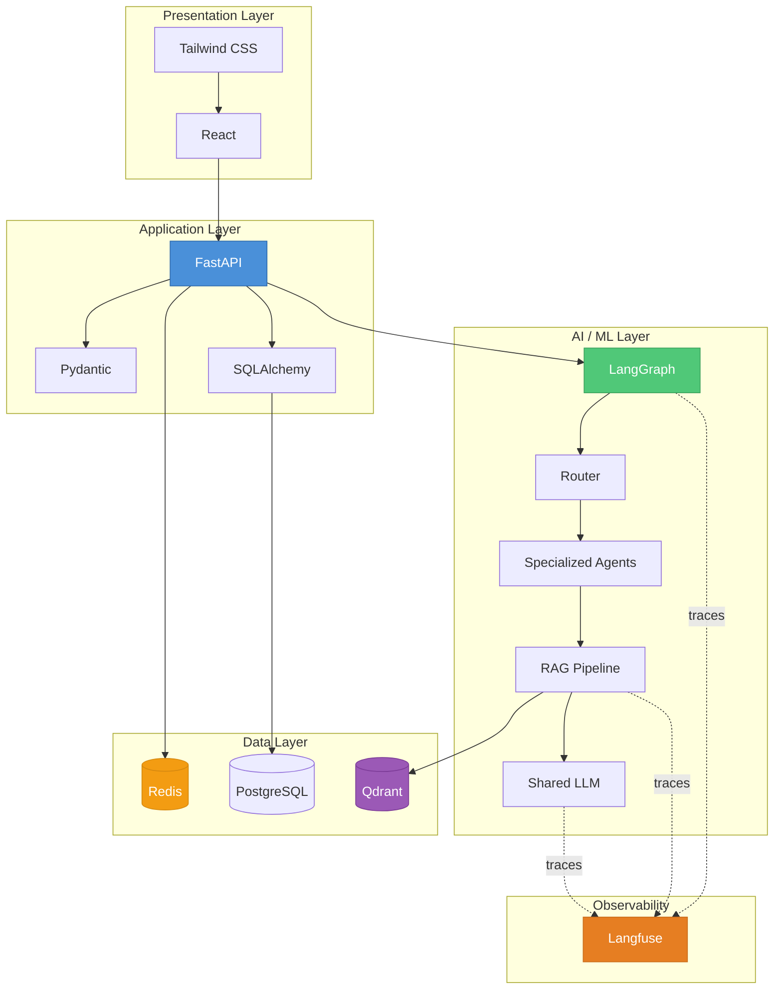

---

# 10. Technology Stack

| Layer | Technology |
|---|---|
| Frontend | React, Vite, Tailwind CSS |
| Backend | Python, FastAPI |
| Validation | Pydantic |
| ORM | SQLAlchemy |
| Workflow | LangGraph |
| LLM | Open-source / local models |
| Embeddings | Open-source embedding models |
| Vector Database | Qdrant |
| Cache and State | Redis |
| Persistent Database | PostgreSQL |
| Observability | Langfuse |
| Containers | Docker, Docker Compose |
| CI/CD | GitHub Actions |

---

# 11. Project Structure

```text
MediOrchestrator/
│
├── frontend/
│
├── backend/
│   ├── api/
│   ├── core/
│   ├── agents/
│   │   ├── general_medicine/
│   │   ├── dermatology/
│   │   ├── nutrition/
│   │   └── dentistry/
│   │
│   ├── routing/
│   ├── rag/
│   ├── memory/
│   ├── cache/
│   ├── safety/
│   ├── observability/
│   └── database/
│
├── docs/
│   ├── PROJECT_OVERVIEW.md
│   ├── ARCHITECTURE.md
│   ├── AGENT_DESIGN.md
│   ├── RAG_PIPELINE.md
│   ├── CACHING_STRATEGY.md
│   └── IMPLEMENTATION_ROADMAP.md
│
├── docker-compose.yml
└── README.md
```

---

# 12. Final System Summary

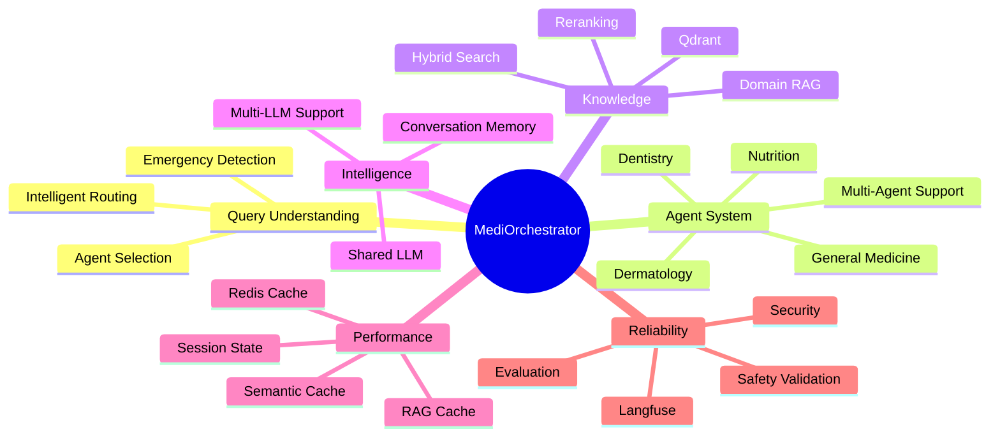

---

## Design Principle

Every component should solve a clear problem.

| Component | Main Job |
|---|---|
| Router | Understand the query |
| Agent Selector | Choose the right workflow |
| Agents | Provide domain specialization |
| RAG | Retrieve relevant knowledge |
| Shared LLM | Reason and generate |
| Redis | Reduce repeated work and store temporary state |
| LangGraph | Manage the workflow |
| Langfuse | Trace and observe the system |
| Safety Layer | Add protective checks |

The architecture should remain modular so that models, agents, retrieval methods, or infrastructure can be improved without redesigning the complete system.
