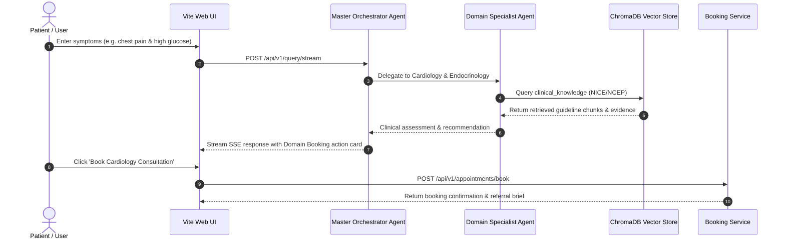

# Clinical Referral & Booking Workflow

```mermaid
sequenceDiagram
    autonumber
    actor User as Patient / User
    participant Frontend as Vite Web UI
    participant Orchestrator as Master Orchestrator Agent
    participant Specialist as Domain Specialist Agent
    participant Chroma as ChromaDB Vector Store
    participant Booking as Booking Service

    User->>Frontend: Enter symptoms (e.g. chest pain & high glucose)
    Frontend->>Orchestrator: POST /api/v1/query/stream
    Orchestrator->>Specialist: Delegate to Cardiology & Endocrinology
    Specialist->>Chroma: Query clinical_knowledge (NICE/NCEP)
    Chroma-->>Specialist: Return retrieved guideline chunks & evidence
    Specialist-->>Orchestrator: Clinical assessment & recommendation
    Orchestrator-->>Frontend: Stream SSE response with Domain Booking action card
    User->>Frontend: Click 'Book Cardiology Consultation'
    Frontend->>Booking: POST /api/v1/appointments/book
    Booking-->>Frontend: Return booking confirmation & referral brief
```
